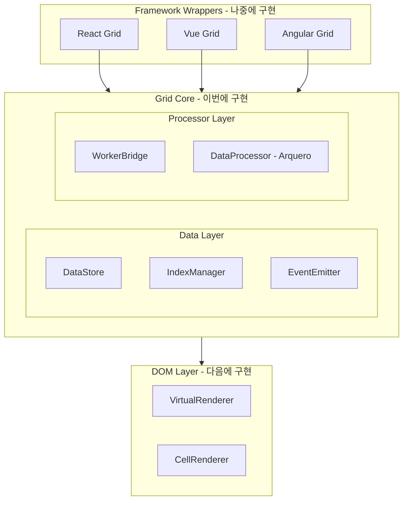

# Grid Core 모듈형 아키텍처 설계

## 1. 전체 아키텍처 개요



### 핵심 설계 원칙

| 원칙 | 설명 |
|------|------|
| **단일 책임** | 각 모듈은 하나의 역할만 담당 |
| **의존성 역전** | 구현이 아닌 인터페이스에 의존 |
| **프레임워크 무관** | React/Vue/Angular에서 동일하게 사용 가능 |
| **이벤트 기반** | 상태 변경을 이벤트로 알림 (반응형 프레임워크 친화적) |
| **교체 가능** | Arquero를 다른 라이브러리로 교체 가능 |

---

## 2. 프로젝트 구조

```
grid/
├── package.json
├── tsconfig.json
├── tsconfig.worker.json          # Worker 전용 설정
├── vite.config.ts                # 빌드 설정
│
├── src/
│   ├── index.ts                  # 라이브러리 진입점
│   │
│   ├── types/                    # 공통 타입 정의
│   │   ├── index.ts
│   │   ├── data.types.ts         # Row, Column, CellValue
│   │   ├── state.types.ts        # SortState, FilterState
│   │   ├── event.types.ts        # 이벤트 타입
│   │   └── processor.types.ts    # IDataProcessor 인터페이스
│   │
│   ├── core/                     # 핵심 모듈 (프레임워크 무관)
│   │   ├── index.ts
│   │   ├── GridCore.ts           # 메인 파사드 클래스
│   │   ├── DataStore.ts          # 원본 데이터 관리
│   │   ├── IndexManager.ts       # 인덱스 배열 관리
│   │   └── EventEmitter.ts       # 이벤트 시스템
│   │
│   ├── processor/                # 데이터 가공 모듈 (분리됨)
│   │   ├── index.ts
│   │   ├── WorkerBridge.ts       # Worker 통신 브릿지
│   │   ├── ArqueroProcessor.ts   # Arquero 기반 구현
│   │   └── worker.ts             # Web Worker 엔트리
│   │
│   └── utils/                    # 유틸리티
│       ├── id.ts                 # ID 생성
│       └── transfer.ts           # Transferable 변환
│
└── tests/
    ├── core/
    └── processor/
```

---

## 3. 모듈별 상세 설계

### 3.1 타입 정의 (`types/`)

모든 모듈이 공유하는 타입을 정의합니다.

```typescript
// types/data.types.ts
export type CellValue = string | number | boolean | Date | null | undefined;

export interface Row {
  [key: string]: CellValue;
}

export interface ColumnDef {
  key: string;
  type: 'string' | 'number' | 'boolean' | 'date';
  label?: string;
  width?: number;
  sortable?: boolean;
  filterable?: boolean;
  editable?: boolean;
}
```

```typescript
// types/state.types.ts
export interface SortState {
  columnKey: string;
  direction: 'asc' | 'desc';
}

export interface FilterOperator {
  type: 'eq' | 'neq' | 'gt' | 'gte' | 'lt' | 'lte' | 
        'contains' | 'startsWith' | 'endsWith' | 'between';
}

export interface FilterState {
  columnKey: string;
  operator: FilterOperator['type'];
  value: CellValue;
  value2?: CellValue;  // for 'between'
}

export interface GroupState {
  columnKeys: string[];
}

export interface ViewState {
  sorts: SortState[];
  filters: FilterState[];
  groups: GroupState | null;
}
```

```typescript
// types/processor.types.ts - 핵심 인터페이스
export interface ProcessorResult {
  indices: Uint32Array;
  totalCount: number;
  filteredCount: number;
}

export interface AggregateResult {
  [groupKey: string]: {
    count: number;
    [columnKey: string]: CellValue;
  };
}

// 프로세서 인터페이스 (구현체 교체 가능)
export interface IDataProcessor {
  initialize(data: Row[]): Promise<void>;
  destroy(): void;
  
  // 기본 연산
  sort(sorts: SortState[]): Promise<ProcessorResult>;
  filter(filters: FilterState[]): Promise<ProcessorResult>;
  
  // 복합 연산
  query(options: {
    sorts?: SortState[];
    filters?: FilterState[];
  }): Promise<ProcessorResult>;
  
  // 집계 연산
  aggregate(options: {
    groupBy: string[];
    aggregates: { column: string; func: 'sum' | 'avg' | 'min' | 'max' | 'count' }[];
  }): Promise<AggregateResult>;
}
```

```typescript
// types/event.types.ts
export type GridEventType =
  | 'data:loaded'
  | 'data:updated'
  | 'data:rowAdded'
  | 'data:rowRemoved'
  | 'data:rowUpdated'
  | 'view:changed'      // 정렬/필터/그룹 변경
  | 'indices:updated'   // 가시 인덱스 변경
  | 'processing:start'  // 처리 시작
  | 'processing:end'    // 처리 완료
  | 'error';            // 에러 발생

export interface GridEvent<T = unknown> {
  type: GridEventType;
  payload: T;
  timestamp: number;
}

// React/Vue에서 구독하기 쉬운 형태
export type GridEventHandler<T = unknown> = (event: GridEvent<T>) => void;
```

---

### 3.2 EventEmitter (`core/EventEmitter.ts`)

프레임워크 독립적인 이벤트 시스템입니다.

```typescript
export class EventEmitter {
  private listeners = new Map<GridEventType, Set<GridEventHandler>>();
  
  // 이벤트 구독 - React useEffect, Vue onMounted에서 사용
  on<T>(type: GridEventType, handler: GridEventHandler<T>): () => void {
    if (!this.listeners.has(type)) {
      this.listeners.set(type, new Set());
    }
    this.listeners.get(type)!.add(handler as GridEventHandler);
    
    // 구독 해제 함수 반환 (cleanup용)
    return () => this.off(type, handler);
  }
  
  // 구독 해제
  off<T>(type: GridEventType, handler: GridEventHandler<T>): void {
    this.listeners.get(type)?.delete(handler as GridEventHandler);
  }
  
  // 이벤트 발행
  emit<T>(type: GridEventType, payload?: T): void {
    const event: GridEvent<T> = {
      type,
      payload: payload as T,
      timestamp: Date.now(),
    };
    
    this.listeners.get(type)?.forEach(handler => {
      try {
        handler(event);
      } catch (error) {
        console.error(`Event handler error for ${type}:`, error);
      }
    });
  }
  
  // 모든 구독 해제 (컴포넌트 언마운트 시)
  removeAllListeners(): void {
    this.listeners.clear();
  }
}
```

---

### 3.3 DataStore (`core/DataStore.ts`)

원본 데이터만 관리합니다. 가공 로직이 없습니다.

```typescript
export class DataStore {
  private rows: Row[] = [];
  private columns: ColumnDef[] = [];
  private rowIdMap = new Map<string, number>();  // ID → 인덱스 매핑
  
  constructor(private events: EventEmitter) {}
  
  // 초기 데이터 설정
  setData(rows: Row[], columns: ColumnDef[]): void {
    this.rows = rows;
    this.columns = columns;
    this.rebuildIdMap();
    this.events.emit('data:loaded', { 
      rowCount: rows.length, 
      columnCount: columns.length 
    });
  }
  
  // 원본 데이터 접근 (읽기 전용)
  getData(): readonly Row[] {
    return this.rows;
  }
  
  getColumns(): readonly ColumnDef[] {
    return this.columns;
  }
  
  getRowCount(): number {
    return this.rows.length;
  }
  
  // 인덱스로 행 접근
  getRowByIndex(index: number): Row | undefined {
    return this.rows[index];
  }
  
  // 여러 인덱스로 행들 접근 (가상화용)
  getRowsByIndices(indices: ArrayLike<number>): Row[] {
    const result: Row[] = [];
    for (let i = 0; i < indices.length; i++) {
      const row = this.rows[indices[i]];
      if (row) result.push(row);
    }
    return result;
  }
  
  // CRUD 작업
  addRow(row: Row): void {
    this.rows.push(row);
    this.rebuildIdMap();
    this.events.emit('data:rowAdded', { row, index: this.rows.length - 1 });
  }
  
  updateRow(index: number, updates: Partial<Row>): void {
    if (this.rows[index]) {
      this.rows[index] = { ...this.rows[index], ...updates };
      this.events.emit('data:rowUpdated', { index, updates });
    }
  }
  
  removeRow(index: number): void {
    if (this.rows[index]) {
      const removed = this.rows.splice(index, 1)[0];
      this.rebuildIdMap();
      this.events.emit('data:rowRemoved', { row: removed, index });
    }
  }
  
  private rebuildIdMap(): void {
    this.rowIdMap.clear();
    this.rows.forEach((row, index) => {
      if (row.id != null) {
        this.rowIdMap.set(String(row.id), index);
      }
    });
  }
}
```

---

### 3.4 IndexManager (`core/IndexManager.ts`)

인덱스 배열만 관리합니다. 데이터 가공 로직이 없습니다.

```typescript
export class IndexManager {
  private totalCount: number = 0;
  private visibleIndices: Uint32Array = new Uint32Array(0);
  
  constructor(private events: EventEmitter) {}
  
  // 초기화
  initialize(rowCount: number): void {
    this.totalCount = rowCount;
    this.visibleIndices = new Uint32Array(rowCount);
    for (let i = 0; i < rowCount; i++) {
      this.visibleIndices[i] = i;
    }
  }
  
  // 프로세서 결과 적용
  applyProcessorResult(result: ProcessorResult): void {
    this.visibleIndices = result.indices;
    this.events.emit('indices:updated', {
      totalCount: result.totalCount,
      visibleCount: result.filteredCount,
    });
  }
  
  // 전체 visible 인덱스
  getVisibleIndices(): Uint32Array {
    return this.visibleIndices;
  }
  
  // 특정 범위의 인덱스 (가상화용)
  getIndicesInRange(start: number, end: number): Uint32Array {
    return this.visibleIndices.slice(start, Math.min(end, this.visibleIndices.length));
  }
  
  // 통계
  getVisibleCount(): number {
    return this.visibleIndices.length;
  }
  
  getTotalCount(): number {
    return this.totalCount;
  }
  
  // 특정 원본 인덱스가 visible인지 확인
  isVisible(originalIndex: number): boolean {
    return this.visibleIndices.includes(originalIndex);
  }
  
  // visible 인덱스에서 원본 인덱스로 변환
  toOriginalIndex(visibleIndex: number): number {
    return this.visibleIndices[visibleIndex];
  }
}
```

---

### 3.5 WorkerBridge (`processor/WorkerBridge.ts`)

Worker와의 통신을 추상화합니다.

```typescript
type MessageHandler = (data: any) => void;

export class WorkerBridge {
  private worker: Worker | null = null;
  private messageId = 0;
  private pendingRequests = new Map<number, {
    resolve: (value: any) => void;
    reject: (error: Error) => void;
  }>();
  
  constructor(private events: EventEmitter) {}
  
  // Worker 초기화
  async initialize(): Promise<void> {
    // Vite/Webpack Worker 번들링 방식
    this.worker = new Worker(
      new URL('./worker.ts', import.meta.url),
      { type: 'module' }
    );
    
    this.worker.onmessage = this.handleMessage.bind(this);
    this.worker.onerror = this.handleError.bind(this);
  }
  
  // 요청 전송 (Promise 기반)
  async send<T>(type: string, payload: any, transfer?: Transferable[]): Promise<T> {
    if (!this.worker) {
      throw new Error('Worker not initialized');
    }
    
    const id = ++this.messageId;
    
    return new Promise((resolve, reject) => {
      this.pendingRequests.set(id, { resolve, reject });
      
      this.events.emit('processing:start', { type });
      
      this.worker!.postMessage(
        { id, type, payload },
        transfer || []
      );
    });
  }
  
  // 응답 처리
  private handleMessage(event: MessageEvent): void {
    const { id, type, payload, error } = event.data;
    
    const pending = this.pendingRequests.get(id);
    if (pending) {
      this.pendingRequests.delete(id);
      this.events.emit('processing:end', { type });
      
      if (error) {
        pending.reject(new Error(error));
      } else {
        pending.resolve(payload);
      }
    }
  }
  
  private handleError(error: ErrorEvent): void {
    this.events.emit('error', { message: error.message });
  }
  
  // 정리
  destroy(): void {
    this.worker?.terminate();
    this.worker = null;
    this.pendingRequests.clear();
  }
}
```

---

### 3.6 ArqueroProcessor (`processor/ArqueroProcessor.ts`)

Arquero를 사용한 IDataProcessor 구현체입니다.

```typescript
import * as aq from 'arquero';
import type { IDataProcessor, ProcessorResult, AggregateResult } from '../types';

// 이 클래스는 Worker 내부에서 실행됨
export class ArqueroProcessor implements IDataProcessor {
  private table: aq.Table | null = null;
  private originalIndices: Uint32Array | null = null;
  
  async initialize(data: Row[]): Promise<void> {
    // Arquero Table로 변환
    this.table = aq.from(data);
    
    // 원본 인덱스 저장
    this.originalIndices = new Uint32Array(data.length);
    for (let i = 0; i < data.length; i++) {
      this.originalIndices[i] = i;
    }
    
    // 인덱스 컬럼 추가 (나중에 추적용)
    this.table = this.table.derive({ __originalIndex__: (d, $) => $.index });
  }
  
  destroy(): void {
    this.table = null;
    this.originalIndices = null;
  }
  
  async sort(sorts: SortState[]): Promise<ProcessorResult> {
    if (!this.table) throw new Error('Not initialized');
    
    let result = this.table;
    
    // 다중 정렬 지원
    for (const sort of sorts.reverse()) {  // 역순으로 적용
      result = result.orderby(
        sort.direction === 'desc' 
          ? aq.desc(sort.columnKey) 
          : sort.columnKey
      );
    }
    
    return this.extractResult(result);
  }
  
  async filter(filters: FilterState[]): Promise<ProcessorResult> {
    if (!this.table) throw new Error('Not initialized');
    
    let result = this.table;
    
    for (const filter of filters) {
      result = result.filter(
        this.buildFilterExpression(filter)
      );
    }
    
    return this.extractResult(result);
  }
  
  async query(options: { 
    sorts?: SortState[]; 
    filters?: FilterState[]; 
  }): Promise<ProcessorResult> {
    if (!this.table) throw new Error('Not initialized');
    
    let result = this.table;
    
    // 필터 먼저 적용
    if (options.filters?.length) {
      for (const filter of options.filters) {
        result = result.filter(this.buildFilterExpression(filter));
      }
    }
    
    // 정렬 적용
    if (options.sorts?.length) {
      const orderCols = options.sorts.map(s => 
        s.direction === 'desc' ? aq.desc(s.columnKey) : s.columnKey
      );
      result = result.orderby(...orderCols);
    }
    
    return this.extractResult(result);
  }
  
  async aggregate(options: {
    groupBy: string[];
    aggregates: { column: string; func: string }[];
  }): Promise<AggregateResult> {
    if (!this.table) throw new Error('Not initialized');
    
    const rollupSpec: Record<string, any> = {};
    
    for (const agg of options.aggregates) {
      const key = `${agg.func}_${agg.column}`;
      rollupSpec[key] = this.getAggregateOp(agg.func, agg.column);
    }
    
    const result = this.table
      .groupby(...options.groupBy)
      .rollup(rollupSpec);
    
    return result.objects() as AggregateResult;
  }
  
  // 결과에서 원본 인덱스 추출
  private extractResult(table: aq.Table): ProcessorResult {
    const indices = new Uint32Array(
      table.array('__originalIndex__') as number[]
    );
    
    return {
      indices,
      totalCount: this.originalIndices!.length,
      filteredCount: indices.length,
    };
  }
  
  private buildFilterExpression(filter: FilterState): any {
    // Arquero escape 함수를 사용한 필터 표현식 생성
    const col = filter.columnKey;
    const val = filter.value;
    
    switch (filter.operator) {
      case 'eq': return (d: any) => d[col] === val;
      case 'neq': return (d: any) => d[col] !== val;
      case 'gt': return (d: any) => d[col] > val;
      case 'gte': return (d: any) => d[col] >= val;
      case 'lt': return (d: any) => d[col] < val;
      case 'lte': return (d: any) => d[col] <= val;
      case 'contains': return (d: any) => String(d[col]).includes(String(val));
      case 'startsWith': return (d: any) => String(d[col]).startsWith(String(val));
      case 'endsWith': return (d: any) => String(d[col]).endsWith(String(val));
      default: return () => true;
    }
  }
  
  private getAggregateOp(func: string, column: string): any {
    switch (func) {
      case 'sum': return aq.op.sum(column);
      case 'avg': return aq.op.mean(column);
      case 'min': return aq.op.min(column);
      case 'max': return aq.op.max(column);
      case 'count': return aq.op.count();
      default: return aq.op.count();
    }
  }
}
```

---

### 3.7 Worker 엔트리 (`processor/worker.ts`)

```typescript
import { ArqueroProcessor } from './ArqueroProcessor';

const processor = new ArqueroProcessor();

self.onmessage = async (event: MessageEvent) => {
  const { id, type, payload } = event.data;
  
  try {
    let result: any;
    
    switch (type) {
      case 'INITIALIZE':
        await processor.initialize(payload.data);
        result = { success: true };
        break;
        
      case 'SORT':
        result = await processor.sort(payload.sorts);
        // Transferable로 전송
        self.postMessage(
          { id, type: 'RESULT', payload: { ...result, indices: result.indices.buffer } },
          [result.indices.buffer]
        );
        return;
        
      case 'FILTER':
        result = await processor.filter(payload.filters);
        self.postMessage(
          { id, type: 'RESULT', payload: { ...result, indices: result.indices.buffer } },
          [result.indices.buffer]
        );
        return;
        
      case 'QUERY':
        result = await processor.query(payload);
        self.postMessage(
          { id, type: 'RESULT', payload: { ...result, indices: result.indices.buffer } },
          [result.indices.buffer]
        );
        return;
        
      case 'AGGREGATE':
        result = await processor.aggregate(payload);
        break;
        
      default:
        throw new Error(`Unknown message type: ${type}`);
    }
    
    self.postMessage({ id, type: 'RESULT', payload: result });
    
  } catch (error) {
    self.postMessage({ 
      id, 
      type: 'ERROR', 
      error: error instanceof Error ? error.message : 'Unknown error' 
    });
  }
};
```

---

### 3.8 GridCore (`core/GridCore.ts`) - 파사드

모든 모듈을 통합하는 메인 클래스입니다.

```typescript
export interface GridCoreOptions {
  columns: ColumnDef[];
  data?: Row[];
}

export class GridCore {
  private events: EventEmitter;
  private dataStore: DataStore;
  private indexManager: IndexManager;
  private workerBridge: WorkerBridge;
  
  private currentViewState: ViewState = {
    sorts: [],
    filters: [],
    groups: null,
  };
  
  constructor(options: GridCoreOptions) {
    // 모듈 초기화
    this.events = new EventEmitter();
    this.dataStore = new DataStore(this.events);
    this.indexManager = new IndexManager(this.events);
    this.workerBridge = new WorkerBridge(this.events);
  }
  
  // 초기화
  async initialize(): Promise<void> {
    await this.workerBridge.initialize();
  }
  
  // 데이터 로드
  async loadData(data: Row[], columns?: ColumnDef[]): Promise<void> {
    if (columns) {
      this.dataStore.setData(data, columns);
    } else {
      this.dataStore.setData(data, this.dataStore.getColumns() as ColumnDef[]);
    }
    
    this.indexManager.initialize(data.length);
    
    // Worker에 데이터 전송
    await this.workerBridge.send('INITIALIZE', { data });
  }
  
  // 정렬
  async sort(sorts: SortState[]): Promise<void> {
    this.currentViewState.sorts = sorts;
    this.events.emit('view:changed', this.currentViewState);
    
    const result = await this.workerBridge.send<ProcessorResult>('QUERY', {
      sorts,
      filters: this.currentViewState.filters,
    });
    
    this.indexManager.applyProcessorResult({
      ...result,
      indices: new Uint32Array(result.indices),
    });
  }
  
  // 필터
  async filter(filters: FilterState[]): Promise<void> {
    this.currentViewState.filters = filters;
    this.events.emit('view:changed', this.currentViewState);
    
    const result = await this.workerBridge.send<ProcessorResult>('QUERY', {
      sorts: this.currentViewState.sorts,
      filters,
    });
    
    this.indexManager.applyProcessorResult({
      ...result,
      indices: new Uint32Array(result.indices),
    });
  }
  
  // 집계
  async aggregate(options: {
    groupBy: string[];
    aggregates: { column: string; func: string }[];
  }): Promise<AggregateResult> {
    return this.workerBridge.send<AggregateResult>('AGGREGATE', options);
  }
  
  // 가상화용 데이터 접근
  getRowsInRange(start: number, end: number): Row[] {
    const indices = this.indexManager.getIndicesInRange(start, end);
    return this.dataStore.getRowsByIndices(indices);
  }
  
  // 이벤트 구독 (React/Vue에서 사용)
  on<T>(type: GridEventType, handler: GridEventHandler<T>): () => void {
    return this.events.on(type, handler);
  }
  
  // 상태 접근
  getViewState(): Readonly<ViewState> {
    return this.currentViewState;
  }
  
  getVisibleRowCount(): number {
    return this.indexManager.getVisibleCount();
  }
  
  getTotalRowCount(): number {
    return this.indexManager.getTotalCount();
  }
  
  // 정리
  destroy(): void {
    this.workerBridge.destroy();
    this.events.removeAllListeners();
  }
}
```

---

## 4. 프레임워크 래퍼 사용 예시 (참고용)

### React에서 사용

```tsx
// 나중에 @grid/react 패키지로 제공
function useGrid(options: GridCoreOptions) {
  const gridRef = useRef<GridCore | null>(null);
  const [visibleRows, setVisibleRows] = useState<Row[]>([]);
  const [isProcessing, setIsProcessing] = useState(false);
  
  useEffect(() => {
    const grid = new GridCore(options);
    gridRef.current = grid;
    
    grid.initialize().then(() => {
      grid.loadData(options.data || []);
    });
    
    // 이벤트 구독
    const unsubIndices = grid.on('indices:updated', () => {
      setVisibleRows(grid.getRowsInRange(0, 50));
    });
    
    const unsubProcessing = grid.on('processing:start', () => {
      setIsProcessing(true);
    });
    
    return () => {
      unsubIndices();
      unsubProcessing();
      grid.destroy();
    };
  }, []);
  
  return { grid: gridRef.current, visibleRows, isProcessing };
}
```

### Vue에서 사용

```typescript
// 나중에 @grid/vue 패키지로 제공
export function useGrid(options: GridCoreOptions) {
  const grid = shallowRef<GridCore | null>(null);
  const visibleRows = ref<Row[]>([]);
  const isProcessing = ref(false);
  
  onMounted(async () => {
    grid.value = new GridCore(options);
    await grid.value.initialize();
    
    grid.value.on('indices:updated', () => {
      visibleRows.value = grid.value!.getRowsInRange(0, 50);
    });
  });
  
  onUnmounted(() => {
    grid.value?.destroy();
  });
  
  return { grid, visibleRows, isProcessing };
}
```

---

## 5. 빌드 설정

### package.json 주요 설정

```json
{
  "name": "@puresheet/core",
  "version": "0.1.0",
  "type": "module",
  "main": "./dist/index.cjs",
  "module": "./dist/index.js",
  "types": "./dist/index.d.ts",
  "exports": {
    ".": {
      "import": "./dist/index.js",
      "require": "./dist/index.cjs",
      "types": "./dist/index.d.ts"
    }
  },
  "files": ["dist"],
  "scripts": {
    "dev": "vite",
    "build": "vite build && tsc --emitDeclarationOnly",
    "test": "vitest"
  },
  "dependencies": {
    "arquero": "^5.x"
  },
  "devDependencies": {
    "typescript": "^5.x",
    "vite": "^5.x",
    "vitest": "^1.x"
  }
}
```

---

## 6. 구현 순서

| 단계 | 모듈 | 설명 |
|------|------|------|
| 1 | 프로젝트 설정 | package.json, tsconfig.json, vite.config.ts |
| 2 | types/ | 모든 타입 정의 |
| 3 | EventEmitter | 이벤트 시스템 |
| 4 | DataStore | 원본 데이터 관리 |
| 5 | IndexManager | 인덱스 배열 관리 |
| 6 | ArqueroProcessor | Arquero 기반 데이터 가공 |
| 7 | worker.ts | Worker 엔트리포인트 |
| 8 | WorkerBridge | Worker 통신 |
| 9 | GridCore | 파사드 클래스 |
| 10 | 테스트 | 각 모듈 단위 테스트 |
