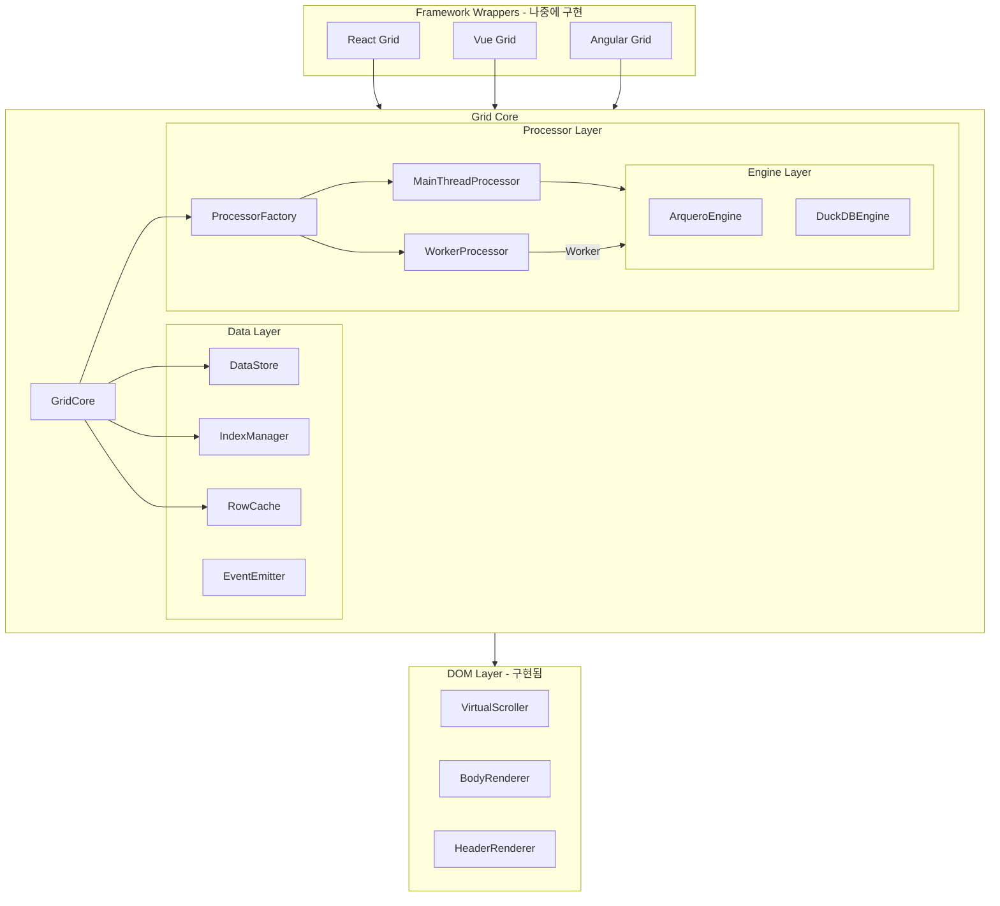

# Grid Core 모듈형 아키텍처 설계

## 1. 전체 아키텍처 개요



### 핵심 설계 원칙

| 원칙 | 설명 |
|------|------|
| **단일 책임** | 각 모듈은 하나의 역할만 담당 |
| **의존성 역전** | 구현이 아닌 인터페이스에 의존 |
| **프레임워크 무관** | React/Vue/Angular에서 동일하게 사용 가능 |
| **이벤트 기반** | 상태 변경을 이벤트로 알림 (반응형 프레임워크 친화적) |
| **교체 가능** | Arquero를 다른 라이브러리로 교체 가능 |
| **메인 스레드 처리** | Worker 오버헤드 없이 직접 처리 (상용 그리드 방식) |

---

## 2. 프로젝트 구조

```
grid/
├── package.json
├── tsconfig.json
├── vite.config.ts                # 빌드 설정
│
├── src/
│   ├── index.ts                  # 라이브러리 진입점
│   │
│   ├── types/                    # 공통 타입 정의
│   │   ├── index.ts
│   │   ├── data.types.ts         # Row, Column, CellValue
│   │   ├── state.types.ts        # SortState, FilterState
│   │   ├── event.types.ts        # 이벤트 타입
│   │   ├── field.types.ts        # FieldDef, PureSheetConfig
│   │   ├── pivot.types.ts        # PivotConfig, PivotResult
│   │   ├── grouping.types.ts     # 그룹핑 타입
│   │   └── processor.types.ts    # IDataProcessor 인터페이스
│   │
│   ├── core/                     # 핵심 모듈 (프레임워크 무관)
│   │   ├── index.ts
│   │   ├── GridCore.ts           # 메인 파사드 클래스
│   │   ├── DataStore.ts          # 원본 데이터 관리
│   │   ├── IndexManager.ts       # 인덱스 배열 관리
│   │   ├── EventEmitter.ts       # 이벤트 시스템
│   │   └── RowCache.ts           # Worker 가상 데이터 캐시 (LRU)
│   │
│   ├── processor/                # 데이터 가공 모듈 (엔진 추상화 + Worker)
│   │   ├── index.ts
│   │   ├── engines/
│   │   │   ├── IEngine.ts              # 공통 엔진 인터페이스
│   │   │   ├── ArqueroEngine.ts        # Arquero 엔진 구현
│   │   │   ├── _deprecated/DuckDBEngine.ts  # DuckDB 엔진 구현
│   │   │   └── index.ts
│   │   ├── MainThreadProcessor.ts      # 메인 스레드 실행
│   │   ├── WorkerProcessor.ts          # Worker 브릿지
│   │   ├── processorWorker.ts          # Worker 스크립트
│   │   ├── ProcessorFactory.ts         # 프로세서 팩토리
│   │   ├── ArqueroProcessor.ts         # 레거시 (엔진 기반으로 전환 중)
│   │   └── PivotProcessor.ts           # 피벗 처리
│   │
│   ├── ui/                       # UI 렌더링 모듈
│   │   ├── PureSheet.ts          # UI 파사드
│   │   ├── GridRenderer.ts       # 그리드 렌더러
│   │   ├── VirtualScroller.ts    # 가상 스크롤
│   │   ├── StatusBar.ts          # 하단 상태 표시줄
│   │   ├── header/               # 헤더 렌더러
│   │   ├── body/                 # 바디 렌더러
│   │   ├── row/                  # 행 클래스
│   │   ├── pivot/                # 피벗 헤더 렌더러
│   │   ├── merge/                # 셀 병합 관리자
│   │   ├── style/                # CSS 스타일
│   │   └── utils/                # UI 유틸리티
│   │
│   └── utils/                    # 유틸리티
│       └── id.ts                 # ID 생성
│
└── tests/
    ├── core/
    └── processor/engines/
```

---

## 3. 모듈별 상세 설계

### 3.1 타입 정의 (`types/`)

모든 모듈이 공유하는 타입을 정의합니다.

```typescript
// types/data.types.ts
export type CellValue = string | number | boolean | Date | null | undefined;

export interface Row {
  [key: string]: CellValue;
}

export interface ColumnDef {
  key: string;
  type: 'string' | 'number' | 'boolean' | 'date';
  label?: string;
  width?: number;
  sortable?: boolean;
  filterable?: boolean;
  editable?: boolean;
}
```

```typescript
// types/state.types.ts
export interface SortState {
  columnKey: string;
  direction: 'asc' | 'desc';
}

export interface FilterOperator {
  type: 'eq' | 'neq' | 'gt' | 'gte' | 'lt' | 'lte' | 
        'contains' | 'startsWith' | 'endsWith' | 'between';
}

export interface FilterState {
  columnKey: string;
  operator: FilterOperator['type'];
  value: CellValue;
  value2?: CellValue;  // for 'between'
}

export interface GroupState {
  columnKeys: string[];
}

export interface ViewState {
  sorts: SortState[];
  filters: FilterState[];
  groups: GroupState | null;
}
```

```typescript
// types/processor.types.ts - 핵심 인터페이스
export interface ProcessorResult {
  indices: Uint32Array;
  totalCount: number;
  filteredCount: number;
}

export interface AggregateResult {
  groupKey: string;
  groupValues: Record<string, CellValue>;
  aggregates: Record<string, CellValue>;
  count: number;
}

// 프로세서 인터페이스 (구현체 교체 가능)
export interface IDataProcessor {
  initialize(data: Row[]): Promise<void>;
  destroy(): void;
  
  // 기본 연산
  sort(sorts: SortState[]): Promise<ProcessorResult>;
  filter(filters: FilterState[]): Promise<ProcessorResult>;
  
  // 복합 연산
  query(options: {
    sorts?: SortState[];
    filters?: FilterState[];
  }): Promise<ProcessorResult>;
  
  // 집계 연산
  aggregate(options: AggregateQueryOptions): Promise<AggregateResult[]>;
}
```

```typescript
// types/event.types.ts
export type GridEventType =
  | 'data:loaded'
  | 'data:updated'
  | 'data:rowAdded'
  | 'data:rowRemoved'
  | 'data:rowUpdated'
  | 'view:changed'      // 정렬/필터/그룹 변경
  | 'indices:updated'   // 가시 인덱스 변경
  | 'processing:start'  // 처리 시작
  | 'processing:end'    // 처리 완료
  | 'error';            // 에러 발생

export interface GridEvent<T = unknown> {
  type: GridEventType;
  payload: T;
  timestamp: number;
}

// React/Vue에서 구독하기 쉬운 형태
export type GridEventHandler<T = unknown> = (event: GridEvent<T>) => void;
```

---

### 3.2 EventEmitter (`core/EventEmitter.ts`)

프레임워크 독립적인 이벤트 시스템입니다.

```typescript
export class EventEmitter {
  private listeners = new Map<GridEventType, Set<GridEventHandler>>();
  
  // 이벤트 구독 - React useEffect, Vue onMounted에서 사용
  on<T>(type: GridEventType, handler: GridEventHandler<T>): () => void {
    if (!this.listeners.has(type)) {
      this.listeners.set(type, new Set());
    }
    this.listeners.get(type)!.add(handler as GridEventHandler);
    
    // 구독 해제 함수 반환 (cleanup용)
    return () => this.off(type, handler);
  }
  
  // 구독 해제
  off<T>(type: GridEventType, handler: GridEventHandler<T>): void {
    this.listeners.get(type)?.delete(handler as GridEventHandler);
  }
  
  // 이벤트 발행
  emit<T>(type: GridEventType, payload?: T): void {
    const event: GridEvent<T> = {
      type,
      payload: payload as T,
      timestamp: Date.now(),
    };
    
    this.listeners.get(type)?.forEach(handler => {
      try {
        handler(event);
      } catch (error) {
        console.error(`Event handler error for ${type}:`, error);
      }
    });
  }
  
  // 모든 구독 해제 (컴포넌트 언마운트 시)
  removeAllListeners(): void {
    this.listeners.clear();
  }
}
```

---

### 3.3 DataStore (`core/DataStore.ts`)

원본 데이터만 관리합니다. 가공 로직이 없습니다.

```typescript
export class DataStore {
  private rows: Row[] = [];
  private columns: ColumnDef[] = [];
  private rowIdMap = new Map<string, number>();  // ID → 인덱스 매핑
  
  constructor(private events: EventEmitter) {}
  
  // 초기 데이터 설정
  setData(rows: Row[], columns: ColumnDef[]): void {
    this.rows = rows;
    this.columns = columns;
    this.rebuildIdMap();
    this.events.emit('data:loaded', { 
      rowCount: rows.length, 
      columnCount: columns.length 
    });
  }
  
  // 원본 데이터 접근 (읽기 전용)
  getData(): readonly Row[] {
    return this.rows;
  }
  
  getColumns(): readonly ColumnDef[] {
    return this.columns;
  }
  
  getRowCount(): number {
    return this.rows.length;
  }
  
  // 인덱스로 행 접근
  getRowByIndex(index: number): Row | undefined {
    return this.rows[index];
  }
  
  // 여러 인덱스로 행들 접근 (가상화용)
  getRowsByIndices(indices: ArrayLike<number>): Row[] {
    const result: Row[] = [];
    for (let i = 0; i < indices.length; i++) {
      const row = this.rows[indices[i]];
      if (row) result.push(row);
    }
    return result;
  }
  
  // CRUD 작업
  addRow(row: Row): void {
    this.rows.push(row);
    this.rebuildIdMap();
    this.events.emit('data:rowAdded', { row, index: this.rows.length - 1 });
  }
  
  updateRow(index: number, updates: Partial<Row>): void {
    if (this.rows[index]) {
      this.rows[index] = { ...this.rows[index], ...updates };
      this.events.emit('data:rowUpdated', { index, updates });
    }
  }
  
  removeRow(index: number): void {
    if (this.rows[index]) {
      const removed = this.rows.splice(index, 1)[0];
      this.rebuildIdMap();
      this.events.emit('data:rowRemoved', { row: removed, index });
    }
  }
  
  private rebuildIdMap(): void {
    this.rowIdMap.clear();
    this.rows.forEach((row, index) => {
      if (row.id != null) {
        this.rowIdMap.set(String(row.id), index);
      }
    });
  }
}
```

---

### 3.4 IndexManager (`core/IndexManager.ts`)

인덱스 배열만 관리합니다. 데이터 가공 로직이 없습니다.

```typescript
export class IndexManager {
  private totalCount: number = 0;
  private visibleIndices: Uint32Array = new Uint32Array(0);
  
  constructor(private events: EventEmitter) {}
  
  // 초기화
  initialize(rowCount: number): void {
    this.totalCount = rowCount;
    this.visibleIndices = new Uint32Array(rowCount);
    for (let i = 0; i < rowCount; i++) {
      this.visibleIndices[i] = i;
    }
  }
  
  // 프로세서 결과 적용
  applyProcessorResult(result: ProcessorResult): void {
    this.visibleIndices = result.indices;
    this.events.emit('indices:updated', {
      totalCount: result.totalCount,
      visibleCount: result.filteredCount,
    });
  }
  
  // 전체 visible 인덱스
  getVisibleIndices(): Uint32Array {
    return this.visibleIndices;
  }
  
  // 특정 범위의 인덱스 (가상화용)
  getIndicesInRange(start: number, end: number): Uint32Array {
    return this.visibleIndices.slice(start, Math.min(end, this.visibleIndices.length));
  }
  
  // 통계
  getVisibleCount(): number {
    return this.visibleIndices.length;
  }
  
  getTotalCount(): number {
    return this.totalCount;
  }
  
  // 특정 원본 인덱스가 visible인지 확인
  isVisible(originalIndex: number): boolean {
    return this.visibleIndices.includes(originalIndex);
  }
  
  // visible 인덱스에서 원본 인덱스로 변환
  toOriginalIndex(visibleIndex: number): number {
    return this.visibleIndices[visibleIndex];
  }
}
```

---

### 3.5 Processor Layer (엔진 추상화 + Worker)

> 상세 결정 과정: [엔진 추상화 아키텍처](../decisions/021-engine-abstraction-architecture.md), [Worker 가상 데이터 로딩](../decisions/022-worker-virtual-data-loading.md)

#### 아키텍처 개요

```
PureSheet / GridCore
       ↓
ProcessorFactory.createProcessor({ engine, useWorker })
       ↓
┌──────────────────────┬──────────────────────┐
│ MainThreadProcessor  │  WorkerProcessor     │
│ (메인 스레드 실행)     │  (Worker 브릿지)      │
└──────┬───────────────┘──────┬───────────────┘
       ↓                      ↓ (postMessage)
┌──────────────────────────────────────────────┐
│         IEngine 인터페이스                      │
│  ┌─────────────────┬──────────────────┐      │
│  │ ArqueroEngine   │  DuckDBEngine    │      │
│  │ (필터/정렬 강점)  │  (집계/SQL 강점)  │      │
│  └─────────────────┴──────────────────┘      │
└──────────────────────────────────────────────┘
```

#### 4가지 실행 조합

| engine | useWorker | 실행 방식 | 사용 케이스 |
|--------|-----------|----------|------------|
| `'aq'` | `false` | Main + Arquero | 기본값, 소량 데이터 |
| `'aq'` | `true` | Worker + Arquero | UI 블로킹 방지 |
| `'db'` | `false` | Main + DuckDB | 테스트/디버깅 |
| `'db'` | `true` | Worker + DuckDB | 대량 데이터 + 복잡 집계 |

#### Worker 가상 데이터 로딩

Worker 모드에서는 전체 데이터를 메인 스레드로 복사하지 않고, `RowCache`를 통해 보이는 행만 요청합니다:

```
스크롤 → RowCache 확인 → 캐시 히트: 즉시 반환
                       → 캐시 미스: fetchVisibleRows() → Worker 요청 → 캐시 저장
```

#### ArqueroProcessor (레거시)

Arquero를 사용한 IDataProcessor 구현체입니다. 엔진 기반 구조로 전환 중이며, 기존 호환성을 위해 유지됩니다.

```typescript
import * as aq from 'arquero';
import type { IDataProcessor, ProcessorResult, AggregateResult } from '../types';

export class ArqueroProcessor implements IDataProcessor {
  private table: aq.Table | null = null;
  private rowCount: number = 0;
  
  async initialize(data: Row[]): Promise<void> {
    this.rowCount = data.length;
    
    // Arquero Table로 변환
    this.table = aq.from(data);
    
    // 원본 인덱스 컬럼 추가
    this.table = this.table.derive({
      __rowIndex__: () => aq.op.row_number() - 1,
    });
  }
  
  destroy(): void {
    this.table = null;
    this.rowCount = 0;
  }
  
  async sort(sorts: SortState[]): Promise<ProcessorResult> {
    if (!this.table) throw new Error('Not initialized');
    
    if (sorts.length === 0) {
      return this.extractIndices(this.table);
    }
    
    const orderArgs = sorts.map((sort) =>
      sort.direction === 'desc' ? aq.desc(sort.columnKey) : sort.columnKey
    );
    
    const sorted = this.table.orderby(...orderArgs);
    return this.extractIndices(sorted);
  }
  
  async filter(filters: FilterState[]): Promise<ProcessorResult> {
    if (!this.table) throw new Error('Not initialized');
    
    if (filters.length === 0) {
      return this.extractIndices(this.table);
    }
    
    let result = this.table;
    for (const filter of filters) {
      result = this.applyFilter(result, filter);
    }
    
    return this.extractIndices(result);
  }
  
  async query(options: QueryOptions): Promise<ProcessorResult> {
    if (!this.table) throw new Error('Not initialized');
    
    let result = this.table;
    
    // 필터 먼저 적용
    if (options.filters?.length) {
      for (const filter of options.filters) {
        result = this.applyFilter(result, filter);
      }
    }
    
    // 정렬 적용
    if (options.sorts?.length) {
      const orderArgs = options.sorts.map(s => 
        s.direction === 'desc' ? aq.desc(s.columnKey) : s.columnKey
      );
      result = result.orderby(...orderArgs);
    }
    
    return this.extractIndices(result);
  }
  
  async aggregate(options: AggregateQueryOptions): Promise<AggregateResult[]> {
    if (!this.table) throw new Error('Not initialized');
    
    let table = this.table;
    
    // 필터 적용
    if (options.filters?.length) {
      for (const filter of options.filters) {
        table = this.applyFilter(table, filter);
      }
    }
    
    // 집계 수행
    const rollupSpec: Record<string, unknown> = {
      count: aq.op.count(),
    };
    
    for (const agg of options.aggregates) {
      const alias = agg.alias || `${agg.function}_${agg.columnKey}`;
      rollupSpec[alias] = this.getAggregateOp(agg.function, agg.columnKey);
    }
    
    const grouped = table.groupby(...options.groupBy).rollup(rollupSpec);
    const grouped = table.groupby(...options.groupBy).rollup(rollupSpec);
    return this.transformAggregateResult(grouped, options);
  }

  /**
   * 피벗 처럼 다중 레벨 집계가 필요한 경우를 위한 메서드
   * (하위 클래스에서 확장하여 사용)
   */
  protected async aggregateMultiLevel(
    options: AggregateQueryOptions,
    levels: string[][]
  ): Promise<AggregateResult[]> {
    // ...
    return [];
  }
  
  private extractIndices(table: aq.Table): ProcessorResult {
    const indices = table.array('__rowIndex__') as number[];
    return {
      indices: new Uint32Array(indices),
      totalCount: this.rowCount,
      filteredCount: indices.length,
    };
  }
  
  private applyFilter(table: aq.Table, filter: FilterState): aq.Table {
    // 필터 로직 구현
    // ...
  }
  
  private getAggregateOp(func: string, column: string): unknown {
    switch (func) {
      case 'sum': return aq.op.sum(column);
      case 'avg': return aq.op.mean(column);
      case 'min': return aq.op.min(column);
      case 'max': return aq.op.max(column);
      case 'count': return aq.op.count();
      default: return aq.op.count();
    }
  }
}
```

---

### 3.6 GridCore (`core/GridCore.ts`) - 파사드

모든 모듈을 통합하는 메인 클래스입니다. **ProcessorFactory를 통해 엔진/Worker 조합을 선택합니다.**

```typescript
export interface GridCoreOptions {
  columns: ColumnDef[];
  data?: Row[];
  idKey?: string;
}

export class GridCore {
  private events: EventEmitter;
  private dataStore: DataStore;
  private indexManager: IndexManager;
  private processor: IDataProcessor;
  private rowCache: RowCache;

  private viewState: ViewState = {
    sorts: [],
    filters: [],
    groups: null,
  };
  
  constructor(options: GridCoreOptions) {
    // 모듈 초기화
    this.events = new EventEmitter();
    this.dataStore = new DataStore(this.events);
    this.indexManager = new IndexManager(this.events);
    this.processor = createProcessor({
      engine: options.engine,
      useWorker: options.useWorker,
    });
    this.rowCache = new RowCache();
    
    // 컬럼 설정
    this.dataStore.setColumns(options.columns);
  }
  
  // 초기화 (Worker 없으므로 단순화)
  async initialize(): Promise<void> {
    // 초기 데이터가 있으면 로드
    if (this.options.data?.length) {
      await this.loadData(this.options.data);
    }
  }
  
  // 데이터 로드
  async loadData(data: Row[], columns?: ColumnDef[]): Promise<void> {
    if (columns) {
      this.dataStore.setColumns(columns);
    }
    
    this.dataStore.setData(data, this.dataStore.getColumns());
    this.indexManager.initialize(data.length);
    
    // Processor에 데이터 전달 (메인 스레드에서 직접)
    await this.processor.initialize(data);
    
    // 뷰 상태 리셋
    this.viewState = { sorts: [], filters: [], groups: null };
  }
  
  // 정렬
  async sort(sorts: SortState[]): Promise<void> {
    this.viewState.sorts = sorts;
    this.events.emit('view:changed', { viewState: this.viewState });
    
    // 메인 스레드에서 직접 처리
    const result = await this.processor.query({
      sorts,
      filters: this.viewState.filters,
    });
    
    this.indexManager.applyProcessorResult(result);
  }
  
  // 필터
  async filter(filters: FilterState[]): Promise<void> {
    this.viewState.filters = filters;
    this.events.emit('view:changed', { viewState: this.viewState });
    
    // 메인 스레드에서 직접 처리
    const result = await this.processor.query({
      sorts: this.viewState.sorts,
      filters,
    });
    
    this.indexManager.applyProcessorResult(result);
  }
  
  // 집계
  async aggregate(options: AggregateQueryOptions): Promise<AggregateResult[]> {
    return this.processor.aggregate(options);
  }
  
  // 가상화용 데이터 접근
  getRowsInRange(start: number, end: number): Row[] {
    const indices = this.indexManager.getIndicesInRange(start, end);
    return this.dataStore.getRowsByIndices(indices);
  }
  
  // 이벤트 구독
  on<T>(type: GridEventType, handler: GridEventHandler<T>): () => void {
    return this.events.on(type, handler);
  }
  
  // 상태 접근
  getViewState(): Readonly<ViewState> {
    return this.viewState;
  }
  
  getVisibleRowCount(): number {
    return this.indexManager.getVisibleCount();
  }
  
  getTotalRowCount(): number {
    return this.indexManager.getTotalCount();
  }
  
  // 정리
  destroy(): void {
    this.processor.destroy();
    this.indexManager.destroy();
    this.events.destroy();
  }
}
```

---

## 4. 데이터 처리 파이프라인

### 4.1 필터 → 정렬 → 피벗

데이터는 항상 다음 순서로 처리됩니다:

```
┌─────────────┐     ┌─────────────┐     ┌─────────────┐     ┌─────────────┐
│   Source    │────▶│   Filter    │────▶│    Sort     │────▶│   Render    │
│    Data     │     │  (조건부)    │     │  (조건부)   │     │             │
└─────────────┘     └─────────────┘     └─────────────┘     └─────────────┘
                                               │
                                               ▼ (피벗 모드)
                                        ┌─────────────┐
                                        │    Pivot    │
                                        │  (집계/변환) │
                                        └─────────────┘
```

### 4.2 처리 원칙

| 원칙 | 설명 |
|------|------|
| **공통 파이프라인** | 필터/정렬은 피벗 사용 여부와 무관하게 공통 적용 |
| **피벗은 추가 연산** | 필터/정렬된 데이터 위에 수행되는 선택적 연산 |
| **중복 처리 방지** | GridCore가 필터/정렬을 1회만 계산 |
| **정렬 반영** | 정렬 대상에 따라 피벗 결과의 행/열 순서 결정 |

### 4.3 정렬이 피벗에 미치는 영향

| 정렬 대상 | 영향 | 예시 |
|----------|------|------|
| **rowFields** | 행 순서 변경 | `product DESC` → Z~A |
| **columnFields** | 컬럼 헤더 순서 변경 | `month DESC` → 12월~1월 |
| **valueFields** | 집계값 기준 행 순서 | `sales DESC` → 매출 높은 순 |

> **상세 문서**: [필터/정렬 → 피벗 파이프라인](../decisions/011-filter-sort-pivot-pipeline.md)

---

## 5. 성능 전략

### 4.1 데이터 규모별 처리 방식

| 규모 | 처리 방식 | 권장 설정 |
|------|----------|----------|
| 1만 건 이하 | 메인 스레드 | `engine: 'aq', useWorker: false` |
| 1-10만 건 | 메인 스레드 + 인덱싱 | `engine: 'aq', useWorker: false` |
| 10-100만 건 | Worker + 가상 데이터 로딩 | `engine: 'aq', useWorker: true` |
| 10-100만 건 (복잡 집계) | Worker + DuckDB | `engine: 'db', useWorker: true` |
| 100만+ 건 | Worker + DuckDB 또는 서버 사이드 | `engine: 'db', useWorker: true` |

### 4.2 최적화 기법

#### 인덱싱

```typescript
// 정렬된 인덱스 캐싱으로 반복 정렬 최적화
class ArqueroProcessor {
  private sortCache = new Map<string, Uint32Array>();
  
  async sort(sorts: SortState[]) {
    const cacheKey = JSON.stringify(sorts);
    if (this.sortCache.has(cacheKey)) {
      return this.sortCache.get(cacheKey);
    }
    // 계산 후 캐싱
  }
}
```

#### 디바운싱

```typescript
// 빠른 필터 입력 시 마지막 값만 처리
const debouncedFilter = debounce((value) => {
  grid.filter([{ columnKey: 'name', operator: 'contains', value }]);
}, 150);
```

#### 가상화

```typescript
// 10만 건 있어도 화면에 보이는 50줄만 렌더링
const visibleRows = grid.getRowsInRange(startRow, endRow);
```

---

## 6. Worker 아키텍처 변천사

### 6.1 초기: Worker 제거 (009 결정)

상용 그리드 분석 결과, 대부분 메인 스레드에서 처리하고 대용량은 서버 사이드로 위임하는 방식을 채택. Worker의 데이터 전송 비용이 연산 비용을 초과하는 문제.

자세한 내용은 [009-remove-worker-architecture.md](../decisions/009-remove-worker-architecture.md) 참조.

### 6.2 현재: 선택적 Worker 재도입 (021, 022 결정)

엔진 추상화 아키텍처를 통해 Worker를 **선택적 옵션**으로 재도입:

```typescript
const sheet = new PureSheet(container, {
  engine: 'aq',        // 'aq' | 'db'
  useWorker: true,     // Worker에서 실행 (기본: false)
});
```

**Worker 재도입이 가능해진 이유:**
1. **가상 데이터 로딩**: 전체 데이터를 전송하지 않고, 보이는 행만 요청 (RowCache)
2. **Transferable**: 인덱스 배열을 복사 없이 전송
3. **엔진 추상화**: 동일 IEngine 인터페이스로 Main/Worker 모두 지원
4. **선택적**: 기본값은 여전히 메인 스레드 (`useWorker: false`)

### 6.3 권장 설정

| 데이터 규모 | 주요 작업 | 권장 설정 |
|------------|----------|----------|
| < 10만 건 | 필터/정렬 | `engine: 'aq', useWorker: false` |
| 10-100만 건 | 필터/정렬 | `engine: 'aq', useWorker: true` |
| 10-100만 건 | 피벗+부분합 | `engine: 'db', useWorker: true` |
| > 100만 건 | 모든 작업 | `engine: 'db', useWorker: true` |

자세한 내용은 [021-engine-abstraction-architecture.md](../decisions/021-engine-abstraction-architecture.md), [022-worker-virtual-data-loading.md](../decisions/022-worker-virtual-data-loading.md) 참조.

---

## 7. 프레임워크 래퍼 사용 예시 (참고용)

### React에서 사용

```tsx
function useGrid(options: GridCoreOptions) {
  const gridRef = useRef<GridCore | null>(null);
  const [visibleRows, setVisibleRows] = useState<Row[]>([]);
  
  useEffect(() => {
    const grid = new GridCore(options);
    gridRef.current = grid;
    
    grid.initialize().then(() => {
      grid.loadData(options.data || []);
    });
    
    // 이벤트 구독
    const unsub = grid.on('indices:updated', () => {
      setVisibleRows(grid.getRowsInRange(0, 50));
    });
    
    return () => {
      unsub();
      grid.destroy();
    };
  }, []);
  
  return { grid: gridRef.current, visibleRows };
}
```

### Vue에서 사용

```typescript
export function useGrid(options: GridCoreOptions) {
  const grid = shallowRef<GridCore | null>(null);
  const visibleRows = ref<Row[]>([]);
  
  onMounted(async () => {
    grid.value = new GridCore(options);
    await grid.value.initialize();
    
    grid.value.on('indices:updated', () => {
      visibleRows.value = grid.value!.getRowsInRange(0, 50);
    });
  });
  
  onUnmounted(() => {
    grid.value?.destroy();
  });
  
  return { grid, visibleRows };
}
```

---

## 8. 구현 순서

| 단계 | 모듈 | 상태 |
|------|------|------|
| 1 | 프로젝트 설정 | ✅ 완료 |
| 2 | types/ | ✅ 완료 |
| 3 | EventEmitter | ✅ 완료 |
| 4 | DataStore | ✅ 완료 |
| 5 | IndexManager | ✅ 완료 |
| 6 | ArqueroProcessor | ✅ 완료 |
| 7 | GridCore | ✅ 완료 |
| 8 | UI Layer | ✅ 완료 |
| 9 | 엔진 추상화 (IEngine, ArqueroEngine, DuckDBEngine) | ✅ 완료 |
| 10 | Worker 재도입 (ProcessorFactory, WorkerProcessor, RowCache) | ✅ 완료 |
