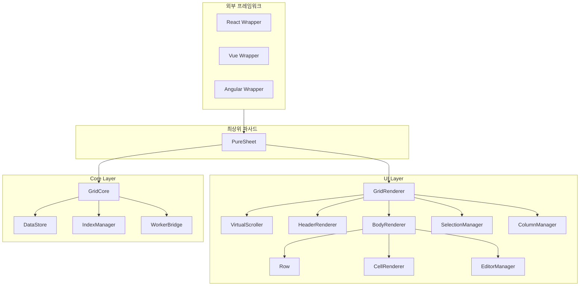
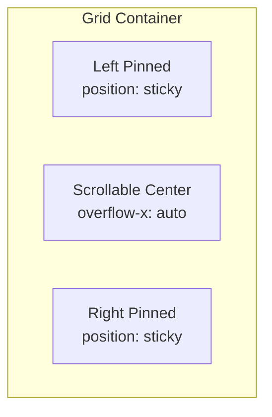

# UI Layer 아키텍처 설계

## 1. 전체 구조 개요



### 핵심 설계 원칙

| 원칙 | 설명 |
|------|------|
| **프레임워크 무관** | Vanilla TypeScript로 구현, React/Vue/Angular에서 래핑 가능 |
| **가상화** | 100만 행도 60fps 유지 (보이는 행만 렌더링) |
| **모듈 분리** | 각 기능(선택, 편집, 컬럼)이 독립적인 모듈 |
| **이벤트 기반** | GridCore의 EventEmitter와 연동하여 반응형 업데이트 |
| **통합 Row 모델** | 단일 Row 클래스로 Body, 고정 영역 모두 처리 |
| **행/컬럼 고정 대칭** | 컬럼 고정(left/right)과 행 고정(top/bottom) 동일 패턴 |

---

## 2. 폴더 구조

```
src/
├── ui/
│   ├── index.ts
│   ├── PureSheet.ts              # 최상위 파사드 (GridCore + UI 통합)
│   ├── GridRenderer.ts           # DOM 렌더링 총괄
│   ├── VirtualScroller.ts        # 가상 스크롤
│   ├── types.ts                  # UI 관련 타입
│   │
│   ├── header/
│   │   ├── HeaderRenderer.ts     # 헤더 영역 렌더링
│   │   └── HeaderCell.ts         # 헤더 셀 컴포넌트
│   │
│   ├── body/
│   │   ├── BodyRenderer.ts       # 바디 영역 렌더링
│   │   ├── RowPool.ts            # 행 DOM 요소 풀링
│   │   └── CellRenderer.ts       # 셀 렌더링 + DOM 풀링
│   │
│   ├── row/                      # Row 클래스 (신규)
│   │   ├── Row.ts                # 통합 Row 클래스
│   │   ├── RowRenderer.ts        # Row 렌더링 로직
│   │   └── types.ts              # Row 관련 타입
│   │
│   ├── interaction/
│   │   ├── SelectionManager.ts   # 행/셀 선택
│   │   ├── EditorManager.ts      # 셀 편집
│   │   ├── ColumnResizer.ts      # 컬럼 너비 조절
│   │   ├── ColumnReorder.ts      # 컬럼 순서 변경 (D&D)
│   │   └── ColumnPinner.ts       # 컬럼 고정 (Left/Right)
│   │
│   └── style/
│       ├── theme.ts              # CSS 변수 기반 테마
│       └── default.css           # 기본 스타일
```

---

## 3. 모듈별 상세 설계

### 3.1 VirtualScroller (Proxy Scrollbar 방식)

100만 행과 **가변 행 높이**를 효율적으로 지원하기 위해 **Proxy Scrollbar** 방식을 채택합니다.

> 상세 결정 과정: [가변 행 높이 가상화 전략](../decisions/003-variable-row-height-virtualization.md)

#### 핵심 아이디어

```
┌─────────────────────────────────────────────┐
│  Grid Container                              │
│  ┌─────────────────────────────┬──────────┐ │
│  │                             │ ▲        │ │
│  │   Viewport (콘텐츠)          │ █ Proxy  │ │
│  │   overflow: hidden          │ █ Scroll │ │
│  │                             │ ▼        │ │
│  └─────────────────────────────┴──────────┘ │
└─────────────────────────────────────────────┘

스크롤바 위치 → 비율 계산 → 행 인덱스 → 해당 행부터 렌더링
```

- **Proxy Scrollbar**: 네이티브 스크롤바를 별도 DOM에서 생성
- **스크롤 비율 → 행 인덱스**: O(1) 계산으로 성능 확보
- **가변 행 높이**: 행 높이를 개별 저장하지 않고 평균값 사용

#### 설정 인터페이스

```typescript
interface VirtualScrollerOptions {
  /**
   * 초기 예상 행 높이 (픽셀)
   * @default 40
   */
  estimatedRowHeight?: number;
  
  /**
   * 평균 계산에 사용할 샘플 수
   * @default 50
   */
  sampleSize?: number;
  
  /**
   * 버퍼 행 수 (위/아래 추가 렌더링)
   * @default 5
   */
  overscan?: number;
}
```

#### DOM 구조

```html
<div class="ps-grid-container">
  <!-- 스크롤바 프록시: 네이티브 스크롤바 담당 -->
  <div class="ps-scroll-proxy">
    <div class="ps-scroll-spacer"></div>  <!-- height: totalRows × avgHeight -->
  </div>
  
  <!-- 실제 콘텐츠: 스크롤바 숨김 -->
  <div class="ps-viewport">
    <div class="ps-row-container">
      <!-- 가상화된 행들 (transform으로 위치 지정) -->
    </div>
  </div>
</div>
```

#### CSS

```css
.ps-grid-container {
  position: relative;
  overflow: hidden;
}

/* 스크롤바 프록시 */
.ps-scroll-proxy {
  position: absolute;
  top: 0;
  right: 0;
  bottom: 0;
  width: 100%;
  overflow-y: auto;
  overflow-x: hidden;
  pointer-events: none;
}
.ps-scroll-proxy::-webkit-scrollbar {
  pointer-events: auto;
}

/* 실제 콘텐츠 */
.ps-viewport {
  position: absolute;
  top: 0;
  left: 0;
  right: 17px;  /* 스크롤바 너비 */
  bottom: 0;
  overflow: hidden;
}

/* 모바일: 스크롤바 오버레이 */
@media (pointer: coarse) {
  .ps-viewport { right: 0; }
}
```

#### 핵심 구현

```typescript
class VirtualScroller {
  // 상태
  private totalRows = 0;
  private estimatedRowHeight = 40;
  private currentRowIndex = 0;
  private overscan = 5;
  
  // 샘플링
  private heightSamples: number[] = [];
  private isHeightLocked = false;
  private sampleSize = 50;
  
  // DOM
  private scrollProxy: HTMLElement;
  private viewport: HTMLElement;
  private spacer: HTMLElement;
  
  /**
   * 프록시 스크롤 → 행 인덱스 계산
   */
  private onProxyScroll = (): void => {
    const { scrollTop, scrollHeight, clientHeight } = this.scrollProxy;
    const maxScroll = scrollHeight - clientHeight;
    const scrollRatio = maxScroll > 0 ? scrollTop / maxScroll : 0;
    
    // 비율 → 행 인덱스 (O(1) 계산)
    const maxRowIndex = Math.max(0, this.totalRows - this.getVisibleRowCount());
    const targetRowIndex = Math.round(scrollRatio * maxRowIndex);
    
    if (targetRowIndex !== this.currentRowIndex) {
      this.currentRowIndex = targetRowIndex;
      this.emit('rowIndexChanged', {
        startIndex: this.currentRowIndex,
        endIndex: this.currentRowIndex + this.getVisibleRowCount() + this.overscan
      });
    }
  };
  
  /**
   * 행 높이 측정 (초기 샘플링)
   */
  measureRow(index: number, height: number): void {
    if (this.isHeightLocked) return;
    
    this.heightSamples.push(height);
    
    // 50개 샘플 수집 후 평균 고정
    if (this.heightSamples.length >= this.sampleSize) {
      const sum = this.heightSamples.reduce((a, b) => a + b, 0);
      this.estimatedRowHeight = sum / this.heightSamples.length;
      this.isHeightLocked = true;
      this.updateSpacerHeight();
    }
  }
  
  /**
   * Spacer 높이 업데이트 (스크롤바 크기 결정)
   */
  private updateSpacerHeight(): void {
    const totalHeight = this.totalRows * this.estimatedRowHeight;
    this.spacer.style.height = `${totalHeight}px`;
  }
  
  /**
   * Viewport 휠/터치 → 프록시로 전달
   */
  private onViewportWheel = (e: WheelEvent): void => {
    this.scrollProxy.scrollTop += e.deltaY;
    e.preventDefault();
  };
}
```

#### 장점

| 항목 | 설명 |
|------|------|
| **O(1) 성능** | 스크롤 비율 → 행 인덱스 직접 계산 |
| **메모리 효율** | 개별 행 높이 저장 불필요 (O(1)) |
| **네이티브 스크롤** | 터치, 관성, 키보드 모두 지원 |
| **접근성** | 스크린 리더 호환 |
| **가변 행 높이** | 평균값 기반으로 자연스럽게 지원 |

#### 관련 결정 문서

- [가변 행 높이 가상화 전략](../decisions/003-variable-row-height-virtualization.md)
- [가로 가상화 전략](../decisions/002-horizontal-virtualization.md)

### 3.2 셀 렌더링 (하이브리드 방식)

> 상세 결정 과정: [셀 렌더링 전략](../decisions/006-cell-rendering-strategy.md)

**채택 방식:** Flexbox Row + Absolute Y (하이브리드)

- **행**: `position: absolute` + `transform: translateY()` → 가상화, GPU 가속
- **셀**: `display: flex` → 간단한 배치
- **컬럼 고정**: `position: sticky`
- **컬럼 너비**: CSS 변수로 관리

#### DOM 구조

```html
<div class="ps-grid-container">
  <!-- 헤더 -->
  <div class="ps-header">
    <div class="ps-header-row">
      <div class="ps-cells-left">
        <div class="ps-header-cell" style="width: var(--col-id-width)">ID</div>
      </div>
      <div class="ps-cells-center">
        <div class="ps-header-cell" style="width: var(--col-name-width)">Name</div>
        <div class="ps-header-cell" style="width: var(--col-email-width)">Email</div>
      </div>
      <div class="ps-cells-right">
        <div class="ps-header-cell" style="width: var(--col-actions-width)">Actions</div>
      </div>
    </div>
  </div>
  
  <!-- 바디: Proxy Scrollbar + 가상화 -->
  <div class="ps-body">
    <div class="ps-scroll-proxy">
      <div class="ps-scroll-spacer"></div>
    </div>
    <div class="ps-viewport">
      <div class="ps-row-container">
        <!-- 가상화된 행 (transform으로 Y 위치) -->
        <div class="ps-row" style="transform: translateY(0px)">
          <div class="ps-cells-left">
            <div class="ps-cell">1</div>
          </div>
          <div class="ps-cells-center">
            <div class="ps-cell">홍길동</div>
            <div class="ps-cell">hong@example.com</div>
          </div>
          <div class="ps-cells-right">
            <div class="ps-cell">Edit</div>
          </div>
        </div>
      </div>
    </div>
  </div>
</div>
```

#### 핵심 CSS

```css
/* 컬럼 너비 CSS 변수 */
.ps-grid-container {
  --col-id-width: 60px;
  --col-name-width: 150px;
  --col-email-width: 200px;
  --col-actions-width: 100px;
}

/* 행: 가상화 (absolute + transform) */
.ps-row {
  position: absolute;
  left: 0;
  right: 0;
  display: flex;
  will-change: transform;
  contain: layout style;
}

/* 셀 컨테이너: 고정/스크롤 분리 */
.ps-cells-left, .ps-cells-right {
  position: sticky;
  z-index: 2;
  background: inherit;
}
.ps-cells-left { left: 0; }
.ps-cells-right { right: 0; }

.ps-cells-center {
  flex: 1;
  display: flex;
  overflow: hidden;
}

/* 셀 */
.ps-cell {
  flex-shrink: 0;
  contain: content;
}
```

#### DOM 풀링

```typescript
class RowPool {
  private pool: HTMLElement[] = [];
  private activeRows: Map<number, HTMLElement> = new Map();
  
  acquire(rowIndex: number): HTMLElement {
    let row = this.pool.pop() ?? this.createRow();
    this.activeRows.set(rowIndex, row);
    return row;
  }
  
  release(rowIndex: number): void {
    const row = this.activeRows.get(rowIndex);
    if (row) {
      this.activeRows.delete(rowIndex);
      this.pool.push(row);
    }
  }
}
```

#### 컬럼 너비 관리

```typescript
// CSS 변수로 너비 관리 → 모든 셀 자동 반영
setColumnWidth(key: string, width: number): void {
  this.container.style.setProperty(`--col-${key}-width`, `${width}px`);
}
```

### 3.3 컬럼 고정 (Pinned Columns)



**DOM 구조:**
```html
<div class="ps-grid">
  <div class="ps-header">
    <div class="ps-header-left">...</div>    <!-- 고정 -->
    <div class="ps-header-center">...</div>  <!-- 스크롤 -->
    <div class="ps-header-right">...</div>   <!-- 고정 -->
  </div>
  <div class="ps-body">
    <div class="ps-row">
      <div class="ps-cells-left">...</div>
      <div class="ps-cells-center">...</div>
      <div class="ps-cells-right">...</div>
    </div>
  </div>
</div>
```

**CSS:**
```css
.ps-cells-left, .ps-cells-right {
  position: sticky;
  z-index: 1;
}
.ps-cells-left { left: 0; }
.ps-cells-right { right: 0; }
```

### 3.4 Row 클래스 및 행 고정

> 상세 결정 과정: [Row 클래스 아키텍처](../decisions/007-row-class-architecture.md)

#### 핵심 개념: Structural vs Non-structural

모든 행은 `structural` 속성으로 이진 분류됩니다:

| 분류 | Structural (구조적) | Non-structural (비구조적) |
|------|---------------------|--------------------------|
| **Selection** | ❌ 선택 안됨 | ✅ 선택 가능 |
| **dataIndex** | ❌ 없음 | ✅ 있음 |
| **예시** | 그룹 헤더, 소계, 합계 | 데이터 행 |
| **용도** | UI 전용 (집계, 구분) | 실제 데이터 표시 |

#### 행 고정 (Row Pinning)

컬럼 고정 패턴을 행에도 적용합니다:

```typescript
// 컬럼 고정 (기존)
column.pinned = 'left' | 'right' | null;

// 행 고정 (신규)
row.pinned = 'top' | 'bottom' | null;
```

#### 그리드 영역 구조

```
┌─────────────────────────────────────────────────┐
│  HeaderRenderer                                 │  ← 컬럼 헤더 (기존)
├─────────────────────────────────────────────────┤
│  Pinned Top Rows                                │  ← Row[] + pinned: 'top'
│  (필터 행, 부가 라벨, 선택 요약 등)               │
├─────────────────────────────────────────────────┤
│  Body (VirtualScroller)                         │  ← Row[] (가상화)
│  - 데이터 행 (non-structural)                    │
│  - 그룹 헤더, 소계 (structural)                  │
├─────────────────────────────────────────────────┤
│  Pinned Bottom Rows = "Footer"                  │  ← Row[] + pinned: 'bottom'
│  (합계, 페이지 정보, 커스텀 등)                   │
└─────────────────────────────────────────────────┘
```

#### DOM 구조

```html
<div class="ps-body">
  <!-- 고정 상단 영역 -->
  <div class="ps-pinned-top">
    <div class="ps-row">...</div>
  </div>
  
  <!-- 가상 스크롤 영역 -->
  <div class="ps-scroll-proxy">
    <div class="ps-scroll-spacer"></div>
  </div>
  <div class="ps-viewport">
    <div class="ps-row-container">
      <!-- 가상화된 행들 -->
    </div>
  </div>
  
  <!-- 고정 하단 영역 (Footer) -->
  <div class="ps-pinned-bottom">
    <div class="ps-row">...</div>
  </div>
</div>
```

#### Row 인터페이스

```typescript
interface RowConfig {
  /** 구조적 행 여부 (선택/인덱스 제외) */
  structural?: boolean;
  
  /** 행 변형 (렌더링 힌트) */
  variant?: 'data' | 'group-header' | 'subtotal' | 'grandtotal' | 'custom';
  
  /** 고정 위치 */
  pinned?: 'top' | 'bottom' | null;
  
  /** 행 데이터 */
  data?: Record<string, any>;
  
  /** 집계 설정 */
  aggregates?: AggregateConfig[];
  
  /** 커스텀 렌더러 */
  render?: (container: HTMLElement, context: RowRenderContext) => void;
}

class Row {
  readonly structural: boolean;
  readonly variant: string;
  readonly pinned: 'top' | 'bottom' | null;
  
  render(container: HTMLElement, context: RowRenderContext): void;
  update(container: HTMLElement, context: RowRenderContext): void;
  getHeight(defaultHeight: number): number;
}
```

#### Footer는 Pinned Bottom Rows

별도의 `FooterRenderer` 없이, Row + 고정으로 Footer를 구현합니다:

```typescript
// Footer = pinned: 'bottom'인 Row들
const grid = new PureSheet(container, {
  pinnedRows: {
    bottom: [
      new Row({
        structural: true,
        variant: 'grandtotal',
        pinned: 'bottom',
        aggregates: [{ columnKey: 'amount', func: 'sum' }],
      }),
    ],
  },
});
```

### 3.5 컬럼 리사이즈

```typescript
class ColumnResizer {
  private resizing = false;
  private startX = 0;
  private startWidth = 0;
  private targetColumn: string | null = null;
  
  onMouseDown(e: MouseEvent, columnKey: string): void {
    this.resizing = true;
    this.startX = e.clientX;
    this.startWidth = this.getColumnWidth(columnKey);
    this.targetColumn = columnKey;
    
    document.addEventListener('mousemove', this.onMouseMove);
    document.addEventListener('mouseup', this.onMouseUp);
  }
  
  private onMouseMove = (e: MouseEvent): void => {
    if (!this.resizing) return;
    
    // requestAnimationFrame으로 성능 최적화
    requestAnimationFrame(() => {
      const delta = e.clientX - this.startX;
      const newWidth = Math.max(50, this.startWidth + delta); // 최소 50px
      this.setColumnWidth(this.targetColumn!, newWidth);
    });
  };
}
```

### 3.6 컬럼 재정렬 (Drag & Drop)

```typescript
class ColumnReorder {
  private dragging = false;
  private draggedColumn: string | null = null;
  private dropIndicator: HTMLElement | null = null;
  
  /**
   * 드래그 시작
   */
  onDragStart(e: DragEvent, columnKey: string): void {
    this.dragging = true;
    this.draggedColumn = columnKey;
    
    e.dataTransfer?.setData('text/plain', columnKey);
    e.dataTransfer!.effectAllowed = 'move';
    
    // 시각적 피드백
    (e.target as HTMLElement).classList.add('ps-dragging');
  }
  
  /**
   * 드롭 위치 계산 및 표시
   */
  onDragOver(e: DragEvent, targetColumn: string): void {
    e.preventDefault();
    e.dataTransfer!.dropEffect = 'move';
    
    // 드롭 인디케이터 표시
    this.showDropIndicator(targetColumn, e.offsetX);
  }
  
  /**
   * 드롭 - 컬럼 순서 변경
   */
  onDrop(e: DragEvent, targetColumn: string): void {
    e.preventDefault();
    
    const newOrder = this.calculateNewOrder(this.draggedColumn!, targetColumn);
    this.emit('columns:reordered', newOrder);
  }
}
```

### 3.7 SelectionManager

```typescript
interface SelectionState {
  selectedRows: Set<string | number>;     // 선택된 행 ID
  selectedCells: Map<string, CellPosition>; // 선택된 셀
  focusedCell: CellPosition | null;        // 포커스된 셀
  selectionMode: 'row' | 'cell' | 'range'; // 선택 모드
  anchorCell: CellPosition | null;         // Shift 선택 시작점
}

class SelectionManager {
  private state: SelectionState = {
    selectedRows: new Set(),
    selectedCells: new Map(),
    focusedCell: null,
    selectionMode: 'row',
    anchorCell: null,
  };
  
  /**
   * 행 클릭 처리
   */
  onRowClick(rowId: string | number, e: MouseEvent): void {
    if (e.ctrlKey || e.metaKey) {
      // Ctrl+클릭: 토글
      this.toggleRowSelection(rowId);
    } else if (e.shiftKey && this.state.anchorCell) {
      // Shift+클릭: 범위 선택
      this.selectRowRange(this.state.anchorCell.rowId, rowId);
    } else {
      // 일반 클릭: 단일 선택
      this.selectSingleRow(rowId);
    }
  }
  
  /**
   * 전체 선택
   */
  selectAll(): void {
    const allIds = this.gridCore.getAllData().map(row => row.id);
    this.state.selectedRows = new Set(allIds);
    this.emit('selection:changed', this.state);
  }
  
  /**
   * 선택 해제
   */
  clearSelection(): void {
    this.state.selectedRows.clear();
    this.state.selectedCells.clear();
    this.emit('selection:changed', this.state);
  }
}
```

### 3.8 EditorManager

```typescript
interface EditorConfig {
  type: 'text' | 'number' | 'date' | 'select' | 'checkbox' | 'custom';
  options?: { value: any; label: string }[];  // select용
  validator?: (value: CellValue) => boolean | string;
  formatter?: (value: CellValue) => string;
  parser?: (input: string) => CellValue;
}

class EditorManager {
  private activeEditor: HTMLElement | null = null;
  private editingCell: CellPosition | null = null;
  private originalValue: CellValue = null;
  
  /**
   * 편집 모드 시작
   */
  startEdit(cell: CellPosition, initialValue?: string): void {
    if (this.activeEditor) {
      this.commitEdit();
    }
    
    this.editingCell = cell;
    this.originalValue = this.getCellValue(cell);
    
    const editor = this.createEditor(cell.columnKey, initialValue);
    this.mountEditor(cell, editor);
    editor.focus();
  }
  
  /**
   * 편집 확정
   */
  commitEdit(): boolean {
    if (!this.activeEditor || !this.editingCell) return false;
    
    const newValue = this.getEditorValue();
    const validation = this.validate(this.editingCell.columnKey, newValue);
    
    if (validation === true) {
      this.gridCore.updateRow(this.editingCell.rowIndex, {
        [this.editingCell.columnKey]: newValue
      });
      this.unmountEditor();
      return true;
    } else {
      this.showValidationError(validation as string);
      return false;
    }
  }
  
  /**
   * 편집 취소
   */
  cancelEdit(): void {
    this.unmountEditor();
    this.editingCell = null;
  }
  
  /**
   * 키보드 단축키
   */
  onKeyDown(e: KeyboardEvent): void {
    switch (e.key) {
      case 'Enter':
        if (this.commitEdit()) {
          this.moveToNextRow();
        }
        break;
      case 'Tab':
        e.preventDefault();
        if (this.commitEdit()) {
          this.moveToNextCell(e.shiftKey ? 'prev' : 'next');
        }
        break;
      case 'Escape':
        this.cancelEdit();
        break;
    }
  }
}
```

---

## 4. PureSheet - 최상위 파사드

GridCore와 UI Layer를 통합하는 메인 클래스.

```typescript
// src/ui/PureSheet.ts

interface PureSheetOptions {
  // 컬럼 정의
  columns: ColumnDef[];
  
  // 초기 데이터
  data?: Record<string, any>[];
  
  // 행 설정
  rowHeight?: number;          // 기본: 32
  headerHeight?: number;       // 기본: 40
  
  // 고정 행 설정 (신규)
  pinnedRows?: {
    top?: Row[];               // 헤더 아래 고정 행
    bottom?: Row[];            // 하단 고정 행 (Footer)
  };
  
  // 선택 설정
  selectionMode?: 'row' | 'cell' | 'range' | 'none';
  multiSelect?: boolean;       // 기본: true
  showCheckboxColumn?: boolean;
  
  // 편집 설정
  editable?: boolean;          // 기본: false
  
  // 컬럼 설정
  resizableColumns?: boolean;  // 기본: true
  reorderableColumns?: boolean;// 기본: true
  
  // 테마
  theme?: 'light' | 'dark' | 'auto';
}

class PureSheet {
  private gridCore: GridCore;
  private gridRenderer: GridRenderer;
  private selectionManager: SelectionManager;
  private editorManager: EditorManager;
  private columnManager: ColumnManager;
  
  constructor(container: HTMLElement, options: PureSheetOptions) {
    // Core 초기화
    this.gridCore = new GridCore({
      columns: options.columns,
      data: options.data,
    });
    
    // UI 초기화
    this.gridRenderer = new GridRenderer(container, this.gridCore, options);
    this.selectionManager = new SelectionManager(this.gridCore);
    this.editorManager = new EditorManager(this.gridCore);
    this.columnManager = new ColumnManager(this.gridCore);
    
    // 이벤트 연결
    this.setupEventListeners();
  }
  
  // ===========================================================================
  // 데이터 API
  // ===========================================================================
  
  async loadData(data: Row[]): Promise<void> {
    await this.gridCore.loadData(data);
    this.gridRenderer.refresh();
  }
  
  async addRow(row: Row): Promise<void> {
    await this.gridCore.addRow(row);
  }
  
  async updateRow(id: string | number, updates: Partial<Row>): Promise<void> {
    const index = this.gridCore._dataStore.getIndexById(id);
    if (index >= 0) {
      await this.gridCore.updateRow(index, updates);
    }
  }
  
  async removeRow(id: string | number): Promise<void> {
    const index = this.gridCore._dataStore.getIndexById(id);
    if (index >= 0) {
      await this.gridCore.removeRow(index);
    }
  }
  
  // ===========================================================================
  // 뷰 API
  // ===========================================================================
  
  async sort(sorts: SortState[]): Promise<void> {
    await this.gridCore.sort(sorts);
  }
  
  async filter(filters: FilterState[]): Promise<void> {
    await this.gridCore.filter(filters);
  }
  
  // ===========================================================================
  // 선택 API
  // ===========================================================================
  
  getSelectedRows(): Row[] {
    const ids = Array.from(this.selectionManager.getSelectedRowIds());
    return ids.map(id => this.gridCore.getRowById(id)).filter(Boolean) as Row[];
  }
  
  selectRows(ids: (string | number)[]): void {
    this.selectionManager.selectRows(ids);
  }
  
  selectAll(): void {
    this.selectionManager.selectAll();
  }
  
  clearSelection(): void {
    this.selectionManager.clearSelection();
  }
  
  // ===========================================================================
  // 고정 행 API (신규)
  // ===========================================================================
  
  /**
   * 고정 행 추가
   */
  addPinnedRow(row: Row, position: 'top' | 'bottom'): void {
    this.gridRenderer.addPinnedRow(row, position);
  }
  
  /**
   * 고정 행 제거
   */
  removePinnedRow(row: Row): void;
  removePinnedRow(rowId: string): void;
  removePinnedRow(rowOrId: Row | string): void {
    this.gridRenderer.removePinnedRow(rowOrId);
  }
  
  /**
   * 고정 행 조회
   */
  getPinnedRows(position: 'top' | 'bottom'): Row[] {
    return this.gridRenderer.getPinnedRows(position);
  }
  
  /**
   * 고정 행 새로고침
   */
  refreshPinnedRows(position?: 'top' | 'bottom'): void {
    this.gridRenderer.refreshPinnedRows(position);
  }
  
  /**
   * 총합계 행 추가 (편의 메서드)
   */
  addGrandTotalRow(aggregates: AggregateConfig[]): Row {
    const row = new Row({
      structural: true,
      variant: 'grandtotal',
      pinned: 'bottom',
      aggregates,
    });
    this.addPinnedRow(row, 'bottom');
    return row;
  }
  
  // ===========================================================================
  // 컬럼 API
  // ===========================================================================
  
  pinColumn(key: string, position: 'left' | 'right'): void {
    this.columnManager.pinColumn(key, position);
    this.gridRenderer.refresh();
  }
  
  unpinColumn(key: string): void {
    this.columnManager.unpinColumn(key);
    this.gridRenderer.refresh();
  }
  
  setColumnWidth(key: string, width: number): void {
    this.columnManager.setWidth(key, width);
  }
  
  setColumnOrder(order: string[]): void {
    this.columnManager.setOrder(order);
    this.gridRenderer.refresh();
  }
  
  hideColumn(key: string): void {
    this.columnManager.hide(key);
    this.gridRenderer.refresh();
  }
  
  showColumn(key: string): void {
    this.columnManager.show(key);
    this.gridRenderer.refresh();
  }
  
  // ===========================================================================
  // 이벤트 API
  // ===========================================================================
  
  on(event: PureSheetEvent, handler: Function): Unsubscribe {
    return this.gridCore.on(event as any, handler as any);
  }
  
  // ===========================================================================
  // 상태 API
  // ===========================================================================
  
  getRowCount(): number {
    return this.gridCore.getTotalRowCount();
  }
  
  getVisibleRowCount(): number {
    return this.gridCore.getVisibleRowCount();
  }
  
  getColumnState(): ColumnState[] {
    return this.columnManager.getState();
  }
  
  // ===========================================================================
  // 정리
  // ===========================================================================
  
  destroy(): void {
    this.gridRenderer.destroy();
    this.selectionManager.destroy();
    this.editorManager.destroy();
    this.columnManager.destroy();
    this.gridCore.destroy();
  }
}
```

---

## 5. 프레임워크 래퍼

### 5.1 React

```typescript
// wrappers/react/usePureSheet.ts
import { useRef, useEffect, useState } from 'react';
import { PureSheet, PureSheetOptions, Row } from '@puresheet/core';

export function usePureSheet(options: PureSheetOptions) {
  const containerRef = useRef<HTMLDivElement>(null);
  const sheetRef = useRef<PureSheet | null>(null);
  const [selectedRows, setSelectedRows] = useState<Row[]>([]);
  
  useEffect(() => {
    if (!containerRef.current) return;
    
    const sheet = new PureSheet(containerRef.current, options);
    sheetRef.current = sheet;
    
    // 선택 변경 이벤트 구독
    const unsubscribe = sheet.on('selection:changed', () => {
      setSelectedRows(sheet.getSelectedRows());
    });
    
    return () => {
      unsubscribe();
      sheet.destroy();
    };
  }, []);
  
  return {
    containerRef,
    sheet: sheetRef,
    selectedRows,
  };
}

// 사용 예시
function MyGrid() {
  const { containerRef, sheet, selectedRows } = usePureSheet({
    columns: [...],
    data: [...],
  });
  
  return (
    <div>
      <div ref={containerRef} style={{ height: 600 }} />
      <p>선택된 행: {selectedRows.length}</p>
    </div>
  );
}
```

### 5.2 Vue

```typescript
// wrappers/vue/usePureSheet.ts
import { ref, shallowRef, onMounted, onUnmounted, Ref } from 'vue';
import { PureSheet, PureSheetOptions, Row } from '@puresheet/core';

export function usePureSheet(options: PureSheetOptions) {
  const container = ref<HTMLElement | null>(null);
  const sheet = shallowRef<PureSheet | null>(null);
  const selectedRows = ref<Row[]>([]);
  
  onMounted(() => {
    if (!container.value) return;
    
    sheet.value = new PureSheet(container.value, options);
    
    sheet.value.on('selection:changed', () => {
      selectedRows.value = sheet.value!.getSelectedRows();
    });
  });
  
  onUnmounted(() => {
    sheet.value?.destroy();
  });
  
  return {
    container,
    sheet,
    selectedRows,
  };
}
```

---

## 6. 성능 최적화 전략

| 기법 | 적용 위치 | 설명 |
|------|----------|------|
| **Virtual Scroll** | BodyRenderer | 보이는 행만 DOM에 렌더링 |
| **DOM Pooling** | CellRenderer | 셀 DOM 요소 재사용 |
| **RAF Throttle** | ColumnResizer, VirtualScroller | 드래그/스크롤 중 렌더링 최적화 |
| **Batch Update** | GridRenderer | 여러 변경을 묶어서 한 번에 렌더 |
| **CSS Containment** | Row, Cell | `contain: strict`로 레이아웃 범위 제한 |
| **Passive Listeners** | Scroll, Wheel | `{ passive: true }`로 스크롤 성능 향상 |
| **Layer Promotion** | Pinned Columns | `will-change: transform`으로 GPU 레이어 분리 |

---

## 7. 이벤트 목록

### PureSheet 이벤트

| 이벤트 | 페이로드 | 설명 |
|--------|----------|------|
| `data:loaded` | `{ rowCount, columnCount }` | 데이터 로드 완료 |
| `row:click` | `{ row, rowIndex, event }` | 행 클릭 |
| `row:dblclick` | `{ row, rowIndex, event }` | 행 더블클릭 |
| `cell:click` | `{ row, columnKey, value, event }` | 셀 클릭 |
| `cell:dblclick` | `{ row, columnKey, value, event }` | 셀 더블클릭 (편집 시작) |
| `cell:change` | `{ row, columnKey, oldValue, newValue }` | 셀 값 변경 |
| `selection:changed` | `{ selectedRows, selectedCells }` | 선택 변경 |
| `column:resize` | `{ columnKey, width }` | 컬럼 너비 변경 |
| `column:reorder` | `{ order }` | 컬럼 순서 변경 |
| `column:pin` | `{ columnKey, position }` | 컬럼 고정 |
| `row:pinned` | `{ row, position }` | 행 고정 추가 |
| `row:unpinned` | `{ row }` | 행 고정 해제 |
| `sort:changed` | `{ sorts }` | 정렬 변경 |
| `filter:changed` | `{ filters }` | 필터 변경 |
| `scroll` | `{ scrollTop, scrollLeft }` | 스크롤 |

---

## 8. 구현 순서

### 1차 구현: 기본 가상화 그리드

| 순서 | 모듈 | 설명 |
|------|------|------|
| 1 | `GridRenderer`, `VirtualScroller`, `BodyRenderer` | 기반 구조 + Proxy Scrollbar |
| 2 | `HeaderRenderer`, `HeaderCell` | 헤더 렌더링 |
| 3 | `CellRenderer` + DOM 풀링 | 셀 렌더링 최적화 |
| 4 | `ColumnManager` | 리사이즈, 고정, 재정렬 |
| 5 | `SelectionManager` | 행/셀 선택 |
| 6 | `EditorManager` | 셀 편집 |
| 7 | `PureSheet` 파사드 | 통합 API |
| 8 | 테스트 및 문서화 | 단위/통합 테스트 |


### 2차 구현: 고급 기능

| 순서 | 기능 | 설명 | 상세 문서 |
|------|------|------|----------|
| 1 | **Row 클래스** | 통합 Row 추상화, 행 고정 | [007](../decisions/007-row-class-architecture.md) |
| 2 | **셀 병합** | 가로+세로 병합, 데이터/API 정의 | [004](../decisions/004-cell-merge-and-row-grouping.md) |
| 3 | **행 그룹화** | 다중 레벨 그룹, 접기/펼치기, 집계 | [004](../decisions/004-cell-merge-and-row-grouping.md) |
| 4 | **Multi-Row** | 1 데이터 행을 N줄로 표시 | [005](../decisions/005-multi-row-layout.md) |
| 5 | 프레임워크 래퍼 | React, Vue 래퍼 | - |

#### Row 클래스 및 행 고정 API (2차)

```typescript
// Row 생성 및 고정
const summaryRow = new Row({
  structural: true,
  variant: 'grandtotal',
  pinned: 'bottom',
  aggregates: [
    { columnKey: 'amount', func: 'sum', formatter: (v) => `₩${v.toLocaleString()}` },
  ],
});

grid.addPinnedRow(summaryRow, 'bottom');

// 커스텀 렌더러 사용
const filterRow = new Row({
  structural: true,
  variant: 'custom',
  pinned: 'top',
  render: (container, ctx) => {
    // 필터 입력 UI 렌더링
  },
});

grid.addPinnedRow(filterRow, 'top');

// 동적 업데이트
summaryRow.setData({ amount: newTotal });
grid.refreshPinnedRows('bottom');
```

#### 셀 병합 API (2차)

```typescript
// 데이터 레벨: 컬럼 정의에서 자동 병합
const columns = [
  { key: 'category', mergeStrategy: 'same-value' }
];

// API 레벨: 동적 병합
sheet.mergeCells('A1:C1');
sheet.unmergeCells('A1:C1');
```

#### 행 그룹화 API (2차)

```typescript
// 컬럼 정의에서 그룹화
const columns = [
  { key: 'country', groupable: true, groupOrder: 1 },
  { key: 'product', groupable: true, groupOrder: 2 },
  { key: 'sales', aggregate: 'sum' }
];

// API로 그룹화
sheet.groupBy(['country', 'product']);
sheet.collapseGroup('country', 'Germany');
sheet.expandAll();
```

#### Multi-Row 레이아웃 API (2차)

```typescript
// rowTemplate으로 1 데이터 행을 여러 줄로 표시
const sheet = new PureSheet(container, {
  columns: [
    { key: 'id', header: 'ID' },
    { key: 'name', header: 'Name' },
    { key: 'email', header: 'Email' },
    { key: 'dept', header: 'Dept' },
    { key: 'phone', header: 'Phone' },
    { key: 'salary', header: 'Salary' },
  ],
  rowTemplate: {
    rowCount: 2,
    layout: [
      // 첫 번째 줄
      [
        { key: 'id', rowSpan: 2 },      // 2줄에 걸침
        { key: 'name' },
        { key: 'email', colSpan: 2 },   // 2칸 차지
        { key: 'salary', rowSpan: 2 },
      ],
      // 두 번째 줄
      [
        { key: 'dept' },
        { key: 'phone' },
      ],
    ],
  },
  data,
});

// 결과:
// ┌────┬─────────┬────────────────────────┬──────────┐
// │    │  Name   │         Email          │          │
// │ ID ├─────────┼───────────┬────────────┤  Salary  │
// │    │  Dept   │   Phone   │            │          │
// └────┴─────────┴───────────┴────────────┴──────────┘
```

---

## 관련 문서

- [Core Architecture](./ARCHITECTURE.md)
- [Worker 환경 지원 전략](../decisions/001-worker-environment-support.md)
- [가로 가상화 전략](../decisions/002-horizontal-virtualization.md)
- [가변 행 높이 가상화 전략](../decisions/003-variable-row-height-virtualization.md)
- [셀 병합 및 행 그룹화 전략](../decisions/004-cell-merge-and-row-grouping.md)
- [Multi-Row 레이아웃 전략](../decisions/005-multi-row-layout.md)
- [셀 렌더링 전략](../decisions/006-cell-rendering-strategy.md)
- [Row 클래스 아키텍처](../decisions/007-row-class-architecture.md)