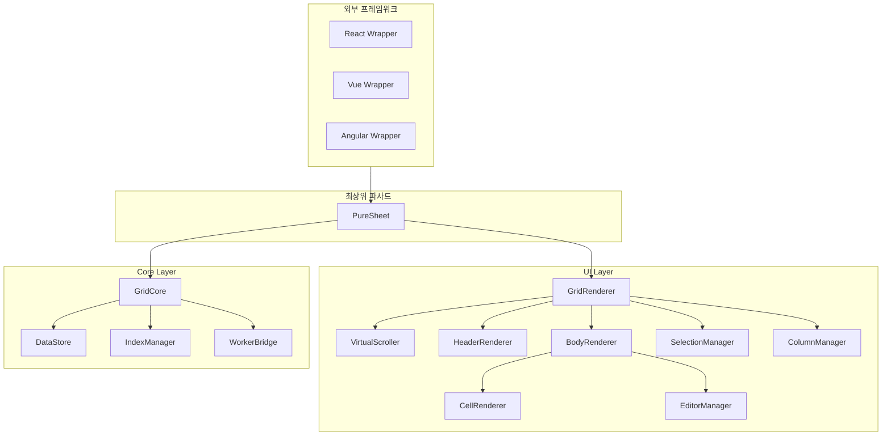
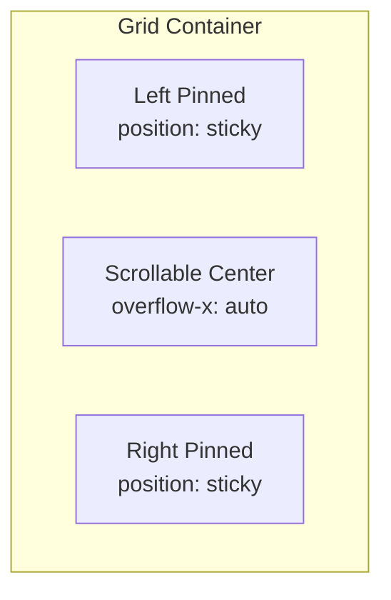

# UI Layer 아키텍처 설계

## 1. 전체 구조 개요



### 핵심 설계 원칙

| 원칙 | 설명 |
|------|------|
| **프레임워크 무관** | Vanilla TypeScript로 구현, React/Vue/Angular에서 래핑 가능 |
| **가상화** | 100만 행도 60fps 유지 (보이는 행만 렌더링) |
| **모듈 분리** | 각 기능(선택, 편집, 컬럼)이 독립적인 모듈 |
| **이벤트 기반** | GridCore의 EventEmitter와 연동하여 반응형 업데이트 |

---

## 2. 폴더 구조

```
src/
├── ui/
│   ├── index.ts
│   ├── PureSheet.ts              # 최상위 파사드 (GridCore + UI 통합)
│   ├── GridRenderer.ts           # DOM 렌더링 총괄
│   ├── VirtualScroller.ts        # 가상 스크롤
│   ├── types.ts                  # UI 관련 타입
│   │
│   ├── header/
│   │   ├── HeaderRenderer.ts     # 헤더 영역 렌더링
│   │   └── HeaderCell.ts         # 헤더 셀 컴포넌트
│   │
│   ├── body/
│   │   ├── BodyRenderer.ts       # 바디 영역 렌더링
│   │   ├── RowRenderer.ts        # 행 렌더링
│   │   └── CellRenderer.ts       # 셀 렌더링 + DOM 풀링
│   │
│   ├── interaction/
│   │   ├── SelectionManager.ts   # 행/셀 선택
│   │   ├── EditorManager.ts      # 셀 편집
│   │   ├── ColumnResizer.ts      # 컬럼 너비 조절
│   │   ├── ColumnReorder.ts      # 컬럼 순서 변경 (D&D)
│   │   └── ColumnPinner.ts       # 컬럼 고정 (Left/Right)
│   │
│   └── style/
│       ├── theme.ts              # CSS 변수 기반 테마
│       └── default.css           # 기본 스타일
```

---

## 3. 모듈별 상세 설계

### 3.1 VirtualScroller

100만 행을 효율적으로 렌더링하기 위한 가상화 스크롤러.

```typescript
interface VirtualScrollerOptions {
  rowHeight: number;           // 행 높이 (고정 또는 가변)
  overscan: number;            // 버퍼 행 수 (위/아래)
  containerHeight: number;     // 컨테이너 높이
}

class VirtualScroller {
  private rowHeight = 32;
  private overscan = 5;
  private visibleStart = 0;
  private visibleEnd = 0;
  
  /**
   * 스크롤 이벤트 처리
   * IndexManager.getIndicesInRange()와 연동
   */
  onScroll(scrollTop: number): void {
    const start = Math.floor(scrollTop / this.rowHeight) - this.overscan;
    const end = start + this.visibleRowCount + this.overscan * 2;
    
    if (start !== this.visibleStart || end !== this.visibleEnd) {
      this.visibleStart = Math.max(0, start);
      this.visibleEnd = Math.min(end, this.totalRowCount);
      this.emit('range:changed', { 
        start: this.visibleStart, 
        end: this.visibleEnd 
      });
    }
  }
  
  /**
   * 전체 높이 계산 (스크롤바 크기 결정)
   */
  get totalHeight(): number {
    return this.totalRowCount * this.rowHeight;
  }
}
```

**핵심 개념:**
- `overscan`: 스크롤 시 깜빡임 방지를 위해 화면 위/아래에 추가 행 렌더링
- `transform: translateY()`: 보이는 영역만 실제 DOM에 배치
- `will-change: transform`: GPU 가속 활용

### 3.2 컬럼 고정 (Pinned Columns)



**DOM 구조:**
```html
<div class="ps-grid">
  <div class="ps-header">
    <div class="ps-header-left">...</div>    <!-- 고정 -->
    <div class="ps-header-center">...</div>  <!-- 스크롤 -->
    <div class="ps-header-right">...</div>   <!-- 고정 -->
  </div>
  <div class="ps-body">
    <div class="ps-row">
      <div class="ps-cells-left">...</div>
      <div class="ps-cells-center">...</div>
      <div class="ps-cells-right">...</div>
    </div>
  </div>
</div>
```

**CSS:**
```css
.ps-cells-left, .ps-cells-right {
  position: sticky;
  z-index: 1;
}
.ps-cells-left { left: 0; }
.ps-cells-right { right: 0; }
```

### 3.3 컬럼 리사이즈

```typescript
class ColumnResizer {
  private resizing = false;
  private startX = 0;
  private startWidth = 0;
  private targetColumn: string | null = null;
  
  onMouseDown(e: MouseEvent, columnKey: string): void {
    this.resizing = true;
    this.startX = e.clientX;
    this.startWidth = this.getColumnWidth(columnKey);
    this.targetColumn = columnKey;
    
    document.addEventListener('mousemove', this.onMouseMove);
    document.addEventListener('mouseup', this.onMouseUp);
  }
  
  private onMouseMove = (e: MouseEvent): void => {
    if (!this.resizing) return;
    
    // requestAnimationFrame으로 성능 최적화
    requestAnimationFrame(() => {
      const delta = e.clientX - this.startX;
      const newWidth = Math.max(50, this.startWidth + delta); // 최소 50px
      this.setColumnWidth(this.targetColumn!, newWidth);
    });
  };
}
```

### 3.4 컬럼 재정렬 (Drag & Drop)

```typescript
class ColumnReorder {
  private dragging = false;
  private draggedColumn: string | null = null;
  private dropIndicator: HTMLElement | null = null;
  
  /**
   * 드래그 시작
   */
  onDragStart(e: DragEvent, columnKey: string): void {
    this.dragging = true;
    this.draggedColumn = columnKey;
    
    e.dataTransfer?.setData('text/plain', columnKey);
    e.dataTransfer!.effectAllowed = 'move';
    
    // 시각적 피드백
    (e.target as HTMLElement).classList.add('ps-dragging');
  }
  
  /**
   * 드롭 위치 계산 및 표시
   */
  onDragOver(e: DragEvent, targetColumn: string): void {
    e.preventDefault();
    e.dataTransfer!.dropEffect = 'move';
    
    // 드롭 인디케이터 표시
    this.showDropIndicator(targetColumn, e.offsetX);
  }
  
  /**
   * 드롭 - 컬럼 순서 변경
   */
  onDrop(e: DragEvent, targetColumn: string): void {
    e.preventDefault();
    
    const newOrder = this.calculateNewOrder(this.draggedColumn!, targetColumn);
    this.emit('columns:reordered', newOrder);
  }
}
```

### 3.5 SelectionManager

```typescript
interface SelectionState {
  selectedRows: Set<string | number>;     // 선택된 행 ID
  selectedCells: Map<string, CellPosition>; // 선택된 셀
  focusedCell: CellPosition | null;        // 포커스된 셀
  selectionMode: 'row' | 'cell' | 'range'; // 선택 모드
  anchorCell: CellPosition | null;         // Shift 선택 시작점
}

class SelectionManager {
  private state: SelectionState = {
    selectedRows: new Set(),
    selectedCells: new Map(),
    focusedCell: null,
    selectionMode: 'row',
    anchorCell: null,
  };
  
  /**
   * 행 클릭 처리
   */
  onRowClick(rowId: string | number, e: MouseEvent): void {
    if (e.ctrlKey || e.metaKey) {
      // Ctrl+클릭: 토글
      this.toggleRowSelection(rowId);
    } else if (e.shiftKey && this.state.anchorCell) {
      // Shift+클릭: 범위 선택
      this.selectRowRange(this.state.anchorCell.rowId, rowId);
    } else {
      // 일반 클릭: 단일 선택
      this.selectSingleRow(rowId);
    }
  }
  
  /**
   * 전체 선택
   */
  selectAll(): void {
    const allIds = this.gridCore.getAllData().map(row => row.id);
    this.state.selectedRows = new Set(allIds);
    this.emit('selection:changed', this.state);
  }
  
  /**
   * 선택 해제
   */
  clearSelection(): void {
    this.state.selectedRows.clear();
    this.state.selectedCells.clear();
    this.emit('selection:changed', this.state);
  }
}
```

### 3.6 EditorManager

```typescript
interface EditorConfig {
  type: 'text' | 'number' | 'date' | 'select' | 'checkbox' | 'custom';
  options?: { value: any; label: string }[];  // select용
  validator?: (value: CellValue) => boolean | string;
  formatter?: (value: CellValue) => string;
  parser?: (input: string) => CellValue;
}

class EditorManager {
  private activeEditor: HTMLElement | null = null;
  private editingCell: CellPosition | null = null;
  private originalValue: CellValue = null;
  
  /**
   * 편집 모드 시작
   */
  startEdit(cell: CellPosition, initialValue?: string): void {
    if (this.activeEditor) {
      this.commitEdit();
    }
    
    this.editingCell = cell;
    this.originalValue = this.getCellValue(cell);
    
    const editor = this.createEditor(cell.columnKey, initialValue);
    this.mountEditor(cell, editor);
    editor.focus();
  }
  
  /**
   * 편집 확정
   */
  commitEdit(): boolean {
    if (!this.activeEditor || !this.editingCell) return false;
    
    const newValue = this.getEditorValue();
    const validation = this.validate(this.editingCell.columnKey, newValue);
    
    if (validation === true) {
      this.gridCore.updateRow(this.editingCell.rowIndex, {
        [this.editingCell.columnKey]: newValue
      });
      this.unmountEditor();
      return true;
    } else {
      this.showValidationError(validation as string);
      return false;
    }
  }
  
  /**
   * 편집 취소
   */
  cancelEdit(): void {
    this.unmountEditor();
    this.editingCell = null;
  }
  
  /**
   * 키보드 단축키
   */
  onKeyDown(e: KeyboardEvent): void {
    switch (e.key) {
      case 'Enter':
        if (this.commitEdit()) {
          this.moveToNextRow();
        }
        break;
      case 'Tab':
        e.preventDefault();
        if (this.commitEdit()) {
          this.moveToNextCell(e.shiftKey ? 'prev' : 'next');
        }
        break;
      case 'Escape':
        this.cancelEdit();
        break;
    }
  }
}
```

---

## 4. PureSheet - 최상위 파사드

GridCore와 UI Layer를 통합하는 메인 클래스.

```typescript
// src/ui/PureSheet.ts

interface PureSheetOptions {
  // 컬럼 정의
  columns: ColumnDef[];
  
  // 초기 데이터
  data?: Row[];
  
  // 행 설정
  rowHeight?: number;          // 기본: 32
  headerHeight?: number;       // 기본: 40
  
  // 선택 설정
  selectionMode?: 'row' | 'cell' | 'range' | 'none';
  multiSelect?: boolean;       // 기본: true
  showCheckboxColumn?: boolean;
  
  // 편집 설정
  editable?: boolean;          // 기본: false
  
  // 컬럼 설정
  resizableColumns?: boolean;  // 기본: true
  reorderableColumns?: boolean;// 기본: true
  
  // 테마
  theme?: 'light' | 'dark' | 'auto';
}

class PureSheet {
  private gridCore: GridCore;
  private gridRenderer: GridRenderer;
  private selectionManager: SelectionManager;
  private editorManager: EditorManager;
  private columnManager: ColumnManager;
  
  constructor(container: HTMLElement, options: PureSheetOptions) {
    // Core 초기화
    this.gridCore = new GridCore({
      columns: options.columns,
      data: options.data,
    });
    
    // UI 초기화
    this.gridRenderer = new GridRenderer(container, this.gridCore, options);
    this.selectionManager = new SelectionManager(this.gridCore);
    this.editorManager = new EditorManager(this.gridCore);
    this.columnManager = new ColumnManager(this.gridCore);
    
    // 이벤트 연결
    this.setupEventListeners();
  }
  
  // ===========================================================================
  // 데이터 API
  // ===========================================================================
  
  async loadData(data: Row[]): Promise<void> {
    await this.gridCore.loadData(data);
    this.gridRenderer.refresh();
  }
  
  async addRow(row: Row): Promise<void> {
    await this.gridCore.addRow(row);
  }
  
  async updateRow(id: string | number, updates: Partial<Row>): Promise<void> {
    const index = this.gridCore._dataStore.getIndexById(id);
    if (index >= 0) {
      await this.gridCore.updateRow(index, updates);
    }
  }
  
  async removeRow(id: string | number): Promise<void> {
    const index = this.gridCore._dataStore.getIndexById(id);
    if (index >= 0) {
      await this.gridCore.removeRow(index);
    }
  }
  
  // ===========================================================================
  // 뷰 API
  // ===========================================================================
  
  async sort(sorts: SortState[]): Promise<void> {
    await this.gridCore.sort(sorts);
  }
  
  async filter(filters: FilterState[]): Promise<void> {
    await this.gridCore.filter(filters);
  }
  
  // ===========================================================================
  // 선택 API
  // ===========================================================================
  
  getSelectedRows(): Row[] {
    const ids = Array.from(this.selectionManager.getSelectedRowIds());
    return ids.map(id => this.gridCore.getRowById(id)).filter(Boolean) as Row[];
  }
  
  selectRows(ids: (string | number)[]): void {
    this.selectionManager.selectRows(ids);
  }
  
  selectAll(): void {
    this.selectionManager.selectAll();
  }
  
  clearSelection(): void {
    this.selectionManager.clearSelection();
  }
  
  // ===========================================================================
  // 컬럼 API
  // ===========================================================================
  
  pinColumn(key: string, position: 'left' | 'right'): void {
    this.columnManager.pinColumn(key, position);
    this.gridRenderer.refresh();
  }
  
  unpinColumn(key: string): void {
    this.columnManager.unpinColumn(key);
    this.gridRenderer.refresh();
  }
  
  setColumnWidth(key: string, width: number): void {
    this.columnManager.setWidth(key, width);
  }
  
  setColumnOrder(order: string[]): void {
    this.columnManager.setOrder(order);
    this.gridRenderer.refresh();
  }
  
  hideColumn(key: string): void {
    this.columnManager.hide(key);
    this.gridRenderer.refresh();
  }
  
  showColumn(key: string): void {
    this.columnManager.show(key);
    this.gridRenderer.refresh();
  }
  
  // ===========================================================================
  // 이벤트 API
  // ===========================================================================
  
  on(event: PureSheetEvent, handler: Function): Unsubscribe {
    return this.gridCore.on(event as any, handler as any);
  }
  
  // ===========================================================================
  // 상태 API
  // ===========================================================================
  
  getRowCount(): number {
    return this.gridCore.getTotalRowCount();
  }
  
  getVisibleRowCount(): number {
    return this.gridCore.getVisibleRowCount();
  }
  
  getColumnState(): ColumnState[] {
    return this.columnManager.getState();
  }
  
  // ===========================================================================
  // 정리
  // ===========================================================================
  
  destroy(): void {
    this.gridRenderer.destroy();
    this.selectionManager.destroy();
    this.editorManager.destroy();
    this.columnManager.destroy();
    this.gridCore.destroy();
  }
}
```

---

## 5. 프레임워크 래퍼

### 5.1 React

```typescript
// wrappers/react/usePureSheet.ts
import { useRef, useEffect, useState } from 'react';
import { PureSheet, PureSheetOptions, Row } from '@puresheet/core';

export function usePureSheet(options: PureSheetOptions) {
  const containerRef = useRef<HTMLDivElement>(null);
  const sheetRef = useRef<PureSheet | null>(null);
  const [selectedRows, setSelectedRows] = useState<Row[]>([]);
  
  useEffect(() => {
    if (!containerRef.current) return;
    
    const sheet = new PureSheet(containerRef.current, options);
    sheetRef.current = sheet;
    
    // 선택 변경 이벤트 구독
    const unsubscribe = sheet.on('selection:changed', () => {
      setSelectedRows(sheet.getSelectedRows());
    });
    
    return () => {
      unsubscribe();
      sheet.destroy();
    };
  }, []);
  
  return {
    containerRef,
    sheet: sheetRef,
    selectedRows,
  };
}

// 사용 예시
function MyGrid() {
  const { containerRef, sheet, selectedRows } = usePureSheet({
    columns: [...],
    data: [...],
  });
  
  return (
    <div>
      <div ref={containerRef} style={{ height: 600 }} />
      <p>선택된 행: {selectedRows.length}</p>
    </div>
  );
}
```

### 5.2 Vue

```typescript
// wrappers/vue/usePureSheet.ts
import { ref, shallowRef, onMounted, onUnmounted, Ref } from 'vue';
import { PureSheet, PureSheetOptions, Row } from '@puresheet/core';

export function usePureSheet(options: PureSheetOptions) {
  const container = ref<HTMLElement | null>(null);
  const sheet = shallowRef<PureSheet | null>(null);
  const selectedRows = ref<Row[]>([]);
  
  onMounted(() => {
    if (!container.value) return;
    
    sheet.value = new PureSheet(container.value, options);
    
    sheet.value.on('selection:changed', () => {
      selectedRows.value = sheet.value!.getSelectedRows();
    });
  });
  
  onUnmounted(() => {
    sheet.value?.destroy();
  });
  
  return {
    container,
    sheet,
    selectedRows,
  };
}
```

---

## 6. 성능 최적화 전략

| 기법 | 적용 위치 | 설명 |
|------|----------|------|
| **Virtual Scroll** | BodyRenderer | 보이는 행만 DOM에 렌더링 |
| **DOM Pooling** | CellRenderer | 셀 DOM 요소 재사용 |
| **RAF Throttle** | ColumnResizer, VirtualScroller | 드래그/스크롤 중 렌더링 최적화 |
| **Batch Update** | GridRenderer | 여러 변경을 묶어서 한 번에 렌더 |
| **CSS Containment** | Row, Cell | `contain: strict`로 레이아웃 범위 제한 |
| **Passive Listeners** | Scroll, Wheel | `{ passive: true }`로 스크롤 성능 향상 |
| **Layer Promotion** | Pinned Columns | `will-change: transform`으로 GPU 레이어 분리 |

---

## 7. 이벤트 목록

### PureSheet 이벤트

| 이벤트 | 페이로드 | 설명 |
|--------|----------|------|
| `data:loaded` | `{ rowCount, columnCount }` | 데이터 로드 완료 |
| `row:click` | `{ row, rowIndex, event }` | 행 클릭 |
| `row:dblclick` | `{ row, rowIndex, event }` | 행 더블클릭 |
| `cell:click` | `{ row, columnKey, value, event }` | 셀 클릭 |
| `cell:dblclick` | `{ row, columnKey, value, event }` | 셀 더블클릭 (편집 시작) |
| `cell:change` | `{ row, columnKey, oldValue, newValue }` | 셀 값 변경 |
| `selection:changed` | `{ selectedRows, selectedCells }` | 선택 변경 |
| `column:resize` | `{ columnKey, width }` | 컬럼 너비 변경 |
| `column:reorder` | `{ order }` | 컬럼 순서 변경 |
| `column:pin` | `{ columnKey, position }` | 컬럼 고정 |
| `sort:changed` | `{ sorts }` | 정렬 변경 |
| `filter:changed` | `{ filters }` | 필터 변경 |
| `scroll` | `{ scrollTop, scrollLeft }` | 스크롤 |

---

## 8. 구현 순서

1. **기반 구조** - `GridRenderer`, `VirtualScroller`, `BodyRenderer`
2. **헤더** - `HeaderRenderer`, `HeaderCell`
3. **셀 렌더링** - `CellRenderer`, DOM 풀링
4. **컬럼 기능** - `ColumnManager`, 리사이즈, 고정, 재정렬
5. **선택** - `SelectionManager`
6. **편집** - `EditorManager`
7. **통합** - `PureSheet` 파사드
8. **프레임워크 래퍼** - React, Vue
9. **테스트 및 문서화**

---

## 관련 문서

- [Core Architecture](./ARCHITECTURE.md)
- [Worker 환경 지원 전략](./decisions/001-worker-environment-support.md)
